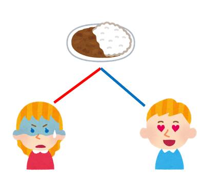
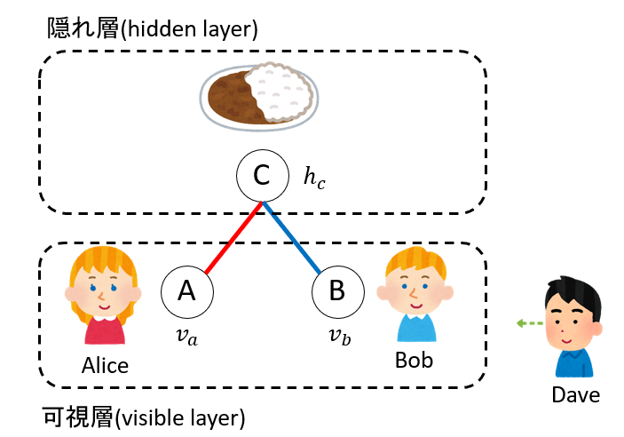
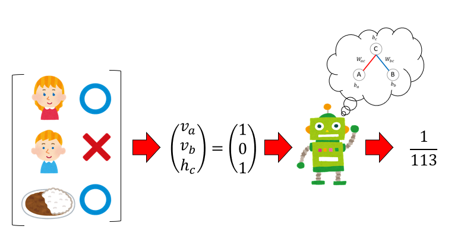

## はじめに

機械学習で用いられるボルツマンマシン、特に制限ボルツマンマシン(Restricted Boltzmann Machine, RBM)は非常に面白い概念ですが、その中身の理解は他のニューラルネットワークに比べて難しく、「数式はわかったが、結局何をやっているのか」が分かりにくい印象です。以下では、なるべく平易な言葉で制限ボルツマンマシンが何をしているのか説明してみようと思います。

## 問題設定

とある大学に通うDaveは、いつもお昼は学食の前のテラスでお弁当を食べます。そして、何の気なしに学食を眺めていると、同じクラスのAliceとBobが学食をよく利用していることに気が付きました。しかし、どうもAliceとBobが同時に現れる確率はかなり低いようです。AliceやBobがお互いに避けているのかと思ってちょっと聞いてみましたが、お互い名前しか知らないようで、特に気にしてないそうです。いったい何が起きているのでしょうか？

Daveは長いこと(239日間！)二人を観察し、AliceとBobが学食に来た日、来ていない日の統計を取りました。

|  A  |  B  | 日数|
| ---- | ---- |---|
|  x  | x  | 35|
|  x  |  o  |56|
|  o  |  x  |113|
|  o  |  o  |35|

例えばAliceもBobも来ていない日は35日、Aliceだけ来てBobが来なかった日は113日ありました。

実は学食を利用していないDaveは知りませんでしたが、この学食は頻繁にカレーフェアを実施しています。Aliceは学食をよく利用していますが、カレーの匂いが苦手なので、カレーフェアの日は学食を利用しません。Bobは普段はあまり学食に来ませんが、カレーが大好きなので、カレーフェアの日は学食を利用する確率が高くなります。

カレーフェア(Curry Fair)をCとして、その開催日をo、開催していない日をxとすると、先ほどの内訳はこうなっていました。

|  A  |  B  | C|  日数|
| ---- | ---- | ---- | ---- |
| x | x | x | 28 |
| x | x | o | 7 |
| x | o | x | 7 |
| x | o | o | 49 |
| o | x | x | 112 |
| o | x | o | 1 |
| o | o | x | 28 |
| o | o | o | 7 |

こうして、カレーフェアが無い日はAliceは学食に来てBobは学食に来ない可能性が高く、カレーフェアの日はAliceは学食に来ないでBobが来る可能性が高いため、結果として「AliceとBobが同時に学食に来る可能性が低い」という状態になっていました。

この、AliceとBobの学食への出現確率をモデル化したい、というのが本稿の目的です。本来であれば、Daveは重要な情報であるカレーフェアのことを知りません[^1]。この隠れた情報であるカレーフェアについて、AliceとBobの観測だけから推定しましょう、というのが制限ボルツマンマシンの目的の一つですが、まずは全てを知っている神の立場から、この学食問題をモデル化してみましょう。

[^1]: この学食では「カレーフェア」のポスターや旗などは出しておらず、外からその開催の有無を判断できませｎ。それじゃどうやってAliceやBobはカレーフェアの開催の有無を知るかって？Lineかウェブサイトでチェックしてるんじゃないですか？(投げやり)

## モデルの変数とパラメータ

### 変数

Aliceをa、Bobをb、カレーフェアをcと略記します。Daveは蚊帳の外です。AliceやBobが学食に来ているかどうか、カレーフェアをやっているかどうかを変数で表すことにしましょう。例えばある日、Aliceが学食に来ているかどうかを変数$v_a$で表すことにします。これは0か1を取る変数で、$v_a=0$ なら今日はAliceは学食に来ておらず、$v_a=1$ なら学食に来ています。Bobが学食に来ているかどうかも変数$v_b$で表しましょう。同様に、カレーフェアが開催しているかどうかを$h_c$という変数で表すことにします。やはり$h_c = 0$ならカレーフェアを開催しておらず、$h_c = 1$なら開催日です。Daveから見て、AliceやBobが来ているかどうかはわかりますが、カレーフェアをやっているかどうかはわかりません。そこで、AliceやBobは「見える(visible)」変数で、カレーフェアについては「隠れた(hidden)」変数と呼ぶことにします。$v_a, v_b$の$v$は「visible」の頭文字、$h_c$の$h$は「hidden」の頭文字です。

### パラメータ

Aliceはカレーフェアが嫌いで、Bobはカレーフェアが好きなので、そこに何か関係がありそうです。AとC、BとCをそれぞれ線で結びましょう。しかし、AliceとBobはお互いに意識していませんので、そこは線で結びません。こうして、以下のような図ができました。

ここで、AliceとBobはDaveから見えるので「可視層(visible layer)」、カレーフェアはDaveから見えないので「隠れ層(hidden layer)」と呼びます。

我々の目的は、AliceやBobが学食にくる確率を与えるモデルを作ることです。そのためにAliceやBobが学食にくる確率の高さや、カレーフェアとの関係をパラメータで表し、そのパラメータから確率を定義しましょう。

Aliceの出現確率にBobは無関係なので、まずはAliceとカレーフェアの関係だけを考えます。Aliceとカレーフェアを結ぶ線にパラメータを定義します。これを **重み(weight)** と呼び、 $W_{ac}$で表すことにしましょう。この重みが正なら「Aliceが学食に来て、かつカレーフェアもやっている確率が高い」、つまりAliceがカレーを好きだということを表すことにします。逆にこの重みが負なら、「Aliceが学食にきて、かつカレーフェアもやっている確率は低い」、すなわちAliceがカレーを嫌いだということを表します。今回のケースでは、Aliceはカレーが嫌いですから、$W_{ac}<0$です。同様にBobとカレーの関係を表す重みを$W_{bc}$で表します。ボブはカレーが好きなので$W_{bc>0}$です。

次に、カレーフェアがやっていない時に、Aliceが学食にくる確率を考えましょう。先程の表から、カレーフェアの開催の有無とAliceが学食に来たかどうかの表はこうなります。

|  A  |  C  | 日数|
| ---- | ---- |---|
|  x  | x  | 35|
|  x  |  o  |56|
|  o  |  x  |140|
|  o  |  o  |8|

まず、カレーフェアがやっていない日について考えましょう。カレーフェアの無い日は35+140=175日ありました。そのうち、Aliceが学食に来たのは140日ですから、4/5の確率で学食に来ています。

カレーフェアとAliceの関係を表す重み$W_{ac}$は、「カレーフェアが開催されており、かつAliceが学食にくる可能性の高さ」を表すパラメータなので、カレーフェアが開催していない時には関係ありません。そこで、新たに「他に何も条件がない場合にAliceが学食に来る可能性の高さ」を表すパラメータを導入しましょう。これを **バイアス(bias)** と呼び、$b_a$で表します。$b_a>0$なら、何もない時にAliceが学食に出現する確率が高いことを、$b_a<0$なら、出現する確率が低いことを表します。全く同様にして、Bobの学食の出現しやすさを表すバイアス$b_b$、カレーフェアの開催確率の高さを表すバイアス$b_c$を定義します。

以上で、このモデルを表現するための全ての変数とパラメータが準備できました。

* 変数
    * $v_a$ Aliceが学食に来ているか。
    * $v_b$ Bobが学食に来ているか。
    * $h_c$ カレーフェアは開催しているか。
* パラメータ
    * $b_a$ Aliceが学食に来る可能性の高さを表すバイアス。
    * $b_b$ Bobが学食に来る可能性の高さを表すバイアス。
    * $b_c$ カレーフェアが開催される可能性の高さを表すバイアス。

変数はこのグラフの頂点(Node)で定義され、0か1の二値を取ります。バイアスも頂点で定義され、正なら変数が1になりやすく、負なら0になりやすい傾向を表現します。重みは辺(Eedge)で定義され、辺がつなぐ2つの頂点の関係を表し、正なら両者が同時に1になりやすく、負ならそうではないことを表しています。

## パラメータから確率への変換

$X$, $Y$, $Z$という事象があるとします。これらのどれかは必ず起きますが、2つ以上同時には起きない(排反事象)としましょう。この3つの事象の「起きやすさ」を表すパラメータを、それぞれ$x$,$y$,$z$とします。これらのパラメータから、例えば$X$が起きる確率をどのように作ればよいでしょうか？

確率が満たすべき条件は、任意の事象の起きる確率が非負の実数で、確率の総和が$1$になるというものです。先程のパラメータ$x$,$y$,$z$は、実数である、という以外の条件はついていません。このパラメータから、例えば$X$が起きる確率を作るのにSoftmaxと呼ばれる関数を使うのが便利です。

$$
P(X) = \frac{\exp(x)}{\exp(x)+\exp(y)+\exp(z)}
$$

要するに、全てのパラメータを指数関数の肩に乗せ、その総和を分母に、自分のパラメータを分子にしたものを「自分が起きる確率」とするものです。指数関数の定義から、どんな実数$x$に対しても$\exp(x) >0$であり、分母にその総和を持ってきているので、$X$、$Y$、$Z$のどれかが起きる確率は$1$になります。

さて、事象が$X$と$Y$の2つしかない場合を考えましょう。それぞれのパラメータを$x$、$y$とすると、$X$が起きる確率$P(X)$と、$Y$が起きる確率$P(Y)$はそれぞれこう書けます。

$$
P(X) = \frac{\exp(x)}{\exp(x)+\exp(y)}
$$

$$
P(Y) = \frac{\exp(y)}{\exp(x)+\exp(y)}
$$

上記の式は、

* 事象$X$ : パラメータ$x$
* 事象$Y$ : パラメータ$y$

について、Softmax型の関数につっこんで確率を作ったものでした。これらの分子と分母をそれぞれ$\exp(y)$で割ってみましょう。

$$
P(X) = \frac{\exp(x-y)}{\exp(x-y)+1} = \frac{1}{1+\exp(y-x)}
$$

$$
P(Y) = \frac{1}{\exp(x-y)+1}
$$

これは、

* 事象$X$ : パラメータ$x-y$
* 事象$Y$ : パラメータ$0$

である場合と等価です。つまり、パラメータをSoftmax型の関数に入れて確率を作る場合、お互いのパラメータの差しか関係しません。$X$と$Y$は違反事象、すなわちどちらかが必ず起きて、同時には起きないのですから、事象$X$が起きるか起きないかだけに注目することにします。事象$X$が起きるパラメータを改めて$x'=x-y$とすると、事象$X$が起きないパラメータは0です。この時、Softmax関数で確率を作ると、$X$が起きる確率は

$$
P(X) = \frac{\exp(x')}{\exp(x')+1} = \frac{1}{1+\exp(-x')}
$$

となります。これをロジスティック関数(logistic function)と呼びます。このように、ロジスティック関数は、多変数のSoftmax関数の特別な場合とみなすことができます。

以上により、それぞれパラメータが定義された事象の起きる確率をSoftmax関数で定義できること、特に「ある事象がおきるか起きないか」の確率はロジスティック関数で定義できることがわかりました。

## モデルパラメータの決定

### Aliceに関係するパラメータ

さて、Aliceはカレーフェアが無い日には4/5の確率で学食に来ます。カレーフェアが無い場合は、カレーフェアとの重み$W_{ac}$は無関係なので、Aliceが学食にくるかどうかはバイアス$b_a$だけで決まります。ある事象が起きるか起きないかは、ロジスティック関数を使えば確率になるのでした。

$$
P(v_a = 1,h_c=0) = \frac{\exp(b_a)}{1 + \exp(b_a)}
$$

$P(v_a = 1, h_c=0) = 4/5$ですから、

$$
\exp(b_a) = 4
$$

と決まります。また、カレーフェアが無い日にAliceが学食に来ない確率は$P(v_a=0) = 1 - P(v_a=1)$ですから、

$$
P(v_a = 0,h_c=0) = \frac{1}{1 + \exp(b_a)}
$$

です。上記2つの確率を見ると、$v_a=1$の時はパラメータ$b_a$の事象が起きる確率を、$v_a=0$の時にはパラメータ$0$の事象が起きる確率を表現しているので、変数$v_a$を使ってまとめて、

$$
P(v_a,h_c=0) = \frac{\exp(v_a b_a)}{1+ \exp(b_a)}
$$

と書くことができます。$v_a$に0や1を代入すれば、$P(v_a=0)$や$P(v_a=1)$の値が得られることがわかるでしょう。分母を和の形に書くと

$$
P(v_a,h_c=0) = \frac{\exp(v_a b_a)}{\sum_{v_a}^{0,1} \exp(v_a b_a)}
$$

となります。

次に、カレーフェアがある日について考えましょう。カレーフェアがある日は、カレーフェアの有無を表す変数$h_c$の値が$1$になります。したがって、カレーフェアのバイアス$b_c$も有効になります。また、「カレーフェアがあり、かつAliceが学食に来る確率の高さ」を表す重み$W_{ac}$もパラメータに加わります。以上から、

* 事象$X$: カレーフェアがあり、かつAliceが来る時のパラメータ: $b_a + b_c + W_{ac}$
* 事象$Y$: カレーフェアがあり、かつAliceがこない時のパラメータ: $b_c$

です。それぞれのパラメータを指数関数の肩に乗せれば確率を得ることができます。

$$
\begin{aligned}
P(v_a=1, h_c=1) &= \frac{\exp(b_a + b_c + W_{ac})}{\exp(b_a + W_{ac}) + \exp(b_c)} \\
P(v_a=0, h_c=1) &= \frac{\exp(b_a + b_c + W_{ac})}{\exp(b_a + W_{ac}) + \exp(b_c)}
\end{aligned}
$$

分子分母に共通する$\exp(b_c)$で割ると以下の形になります。

$$
\begin{aligned}
P(v_a=1, h_c=1) &= \frac{\exp(b_a + W_{ac})}{\exp(b_a + W_{ac}) + 1} \\
P(v_a=0, h_c=1) &= \frac{\exp(b_a + W_{ac})}{\exp(b_a + W_{ac}) + 1}
\end{aligned}
$$

上記の確率は、先程の事象の重みを以下のように与えたのと等価です。

* 事象$X$: カレーフェアがあり、かつAliceが来る時のパラメータ: $b_a + W_{ac}$
* 事象$Y$: カレーフェアがあり、かつAliceがこない時のパラメータ: $0$

これは、パラメータをSoftmax関数を使って確率を作る場合、パラメータは差しか関係がないことに対応しています。

先ほどの表をもう一度見てみましょう。

|  A  |  C  | 日数|
| ---- | ---- |---|
|  x  | x  | 35|
|  x  |  o  |56|
|  o  |  x  |140|
|  o  |  o  |8|

カレーフェアがあった日は56+8=64日です。そのうち、Aliceが学食に来たのは8日、つまり1/8の確率でしか学食に来ていません。

従って、

$$
P(v_a=1, h_c=1) = \frac{\exp(b_a + W_{ac})}{\exp(b_a + W_{ac}) + 1} = \frac{1}{8}
$$

です。先程求めた

$$
\exp(b_a) = 4
$$

とを使って解けば、

$$
\exp(W_{ac}) = \frac{1}{28}
$$

と求めることができます。以上からカレーフェアのある日のAliceの出現確率を、以下のように表すことができました。

$$
\begin{aligned}
P(v_a=0, h_c=1) &= \frac{\exp(b_a + W_{ac})}{\exp(b_a + W_{ac}) + 1} = \frac{1}{8}\\
P(v_a=1, h_c=1) &= \frac{1}{\exp(b_a + W_{ac}) + 1} = \frac{7}{8}
\end{aligned}
$$

後で$h_c=0$の場合とまとめるため、先程無視したカレーフェアのバイアス$b_c$も入れておきましょう。

$$
\begin{aligned}
P(v_a=0, h_c=1) &= \frac{\exp(b_a + b_c + W_{ac})}{\exp(b_a + b_c + W_{ac}) + 1} = \frac{1}{8}\\
P(v_a=1, h_c=1) &= \frac{\exp(b_c)}{\exp(b_a + b_c + W_{ac}) + 1} = \frac{7}{8}
\end{aligned}
$$

分子分母に$\exp(b_c)$をかけただけです。$h_c=0$の場合と同様に、これを変数$v_a,h_a$を使って和の形にまとめましょう。

$$
P(v_a, h_c) = \frac{\exp(b_a v_a+ b_c h_c + W_{ac} v_a h_c)}{\sum_{v_a, h_c}\exp(b_a v_a+ b_c h_c + W_{ac} v_a h_c)}
$$

ただし和は$v_a = 0, 1$、$h_c = 0,1$の4通りについて取ります。右辺は、カレーフェアの有無とAliceが学食にくる確率との関係を表すモデルであるとみなすことができます。$P(v_a, h_c)$の変数$v_a$、$h_c$に0と1の好きな値を代入すれば、知りたい事象の確率を得ることができます。モデルパラメータは、バイアス$b_a$と重み$W_{ac}$です。パラメータとして、カレーフェアのバイアス$b_c$も入っていますが、これは現時点では分子分母でキャンセルしてしまうので、値が決まりません。

### Bobに関係するパラメータ

Aliceと同様に、Bobに関係するパラメータも決めていきましょう。Bobが学食に来たかどうかと、カレーフェアの開催の有無の表はこうなります。

|  B  |  C  | 日数|
| ---- | ---- |---|
|  x  | x  | 140|
|  x  |  o  |8|
|  o  |  x  |35|
|  o  |  o  |56|

カレーフェアが無い日にBobが学食に来る確率から、Bobのバイアス$b_b$が求まります。

$$
P(v_b=1, h_c=0) = \frac{\exp(b_b)}{1 + \exp(b_b)} = \frac{1}{5}
$$

から、

$$
\exp(b_b) = \frac{1}{4}
$$

と求められます。また、Aliceと同様な手続きにより、カレーフェアのある日のBobの出現確率が$7/8$であることから、

$$
\exp(W_{bc}) = 28
$$

と求められます。

### カレーフェアに関するパラメータ

ここまでで、AliceとBobのバイアス$b_a, b_b$と、カレーフェアとの重み$W_{ac}, W_{bc}$が求まりました。残るパラメータはカレーフェアのバイアス$b_c$だけです。こちらを求めるのは簡単で、AliceとBobが両方学食に来ていない時のカレーフェアの開催確率を見ればOKです。最初の表から関連するところを抜粋してみましょう。

|  A  |  B  | C|  日数|
| ---- | ---- | ---- | ---- |
| x | x | x | 28 |
| x | x | o | 7 |

AliceもBobも学食に来ていない日は35日間あり、そのうちカレーフェアをやっていたのは7日間でした。つまり、AliceもBobも学食に来ていない日にカレーフェアが開催される確率は$1/5$です。

これをバイアス$b_c$を使って表すと、

$$
P(v_a=0, v_b = 0, v_c=1) = \frac{\exp(b_c)}{1+\exp(b_c)} = \frac{1}{5}
$$

です。ここから、

$$
\exp(b_c) = \frac{1}{4}
$$

と求められます。

以上から、全てのバイアスと重みを求めることができました。

## ボルツマンマシンの解釈

我々が欲しいのは、

* A: Aliceが学食に来る/来ない
* B: Bobが学食に来る/こない
* C: カレーフェアが開催している/していない

というA, B, Cの3つの事象について、同時確率を与えるモデルでした。そのために、それぞれの事象に対応する変数$v_a, v_b, h_c$を用意し、それぞれに0か1を代入すると、欲しい確率を返す確率モデル$P(v_a, v_b, h_c)$を作りました。その具体的な形は以下の通りです。

$$
P(v_a, v_b, h_c) = \frac{\exp(b_a v_a+ b_b v_b+ b_c h_c + W_{ac}v_a h_c + W_{bc}v_b h_c)}{\sum_{v_a, v_b, h_c}\exp(b_a v_a+ b_b v_b+ b_c h_c + W_{ac}v_a h_c + W_{bc}v_b h_c) }
$$

分子と分母に長ったらしい同じ式が出てきているのでまとめたくなりますね。これを$H$という関数で表現しましょう。後のために負符号をつけておきます。

$$
H(v_a, v_b, h_c) = -(b_a v_a+ b_b v_b+ b_c h_c + W_{ac}v_a h_c + W_{bc}v_b h_c)
$$

$a,b,c$を、それぞれ$1,2,3$と通し番号を振ります。そして、$v_a$を$\sigma_1$、$v_b$を$\sigma_2$、$h_c$を$\sigma_3$と名前をつけ直しましょう。すると、先程の$H$の形がすこしすっきり書けます。

$$
H(\{\sigma_i\}) = -\sum_i b_i \sigma_i -\sum_{i<j} J_{ij} \sigma_i \sigma_j
$$

ここで、$b_1 = b_a, b_2 = b_b, b_3 = b_c, J_{12} = 0, J_{13} = W_{ac},W_{23} = J_{bc}$です。

この式を見ると、まるで各サイト$i$に局所的な磁場$b_i$がかかり、サイト$i$とサイト$j$の間に相互作用$J_{ij}$があるようなイジングスピン系のエネルギーであるかのように見えます。

この$H$を使うと、確率は以下のように書けます。

$$
P(\{\sigma_i\}) = \frac{\exp{(-H)}}{\sum_{\{\sigma_i\}} \exp{(-H)}}
$$

ただし$\sum_{\{\sigma_i\}}$は、全てのスピンの状態に関する和をとる、という意味で、この場合は$\sigma_1 = 0, \sigma_2 = 0, \sigma_3 = 0$から$\sigma_1 = 1, \sigma_2 = 1, \sigma_3 = 1$まで、8通りの状態の和を意味しています。

この式は、$H$をエネルギーだとみなした時、その状態がボルツマン重み$\exp{(-H)}$に比例して実現する、という統計力学の原理と全く同じ形をしています。

分母はよく使うので、$Z$という名前をつけておきましょう。

$$
Z = \sum_{\{\sigma_i\}} \exp{(-H)}
$$

です。これは統計力学における分配関数にほかなりません。

このように、状態を表す変数の値が0か1の二値であり、ある変数の状態の実現確率がボルツマン重みで記述されるようなモデルをボルツマンマシン(Bolzmann machine)と呼びます。ボルツマンマシンは、パラメータが決まってしまえば、任意の変数の状態の同時確率や条件付き確率を計算することができるマシンです。

特に、スピンを2つのグループにわけることができて、同じグループ内に相互作用が無い場合を **制限ボルツマンマシン(restricted Bolzmann machine, RBM)** と呼びます。今回のケースはRBMになっています。RBMは表現能力が高いまま、学習が容易になるという特徴を持っており、広く使われています。

例えば、Aliceが学食に来て$(v_a=1)$、Bobが学食に来ていない$v_b=0$、という条件において、カレーフェアが開催している($h_c=1$)という確率を計算してみましょう。

条件付き確率の定義から

$$
P(h_c=1 | v_a=1, v_b=0) = \frac{P(h_c=1,v_a=1, v_b=0)}{P(v_a=1, v_b=0)}
$$

となります。

右辺の分子、分母をそれぞれ書き下すと、

$$
P(h_c=1,v_a=1, v_b=0) = \frac{\exp({b_a + b_c + W_{ac}})}{Z}
$$

$$
\begin{aligned}
P(v_a=1, v_b=0) &= P(v_a=1, v_b=0, h_c=0)+P(v_a=1, v_b=0, h_c=1)\\
&= \frac{\exp{(b_a)}}{Z} + \frac{\exp(b_a+b_c+W_{ac})}{Z}
\end{aligned}
$$

これを代入すると、分子分母で$Z$と$\exp{(b_a)}$がキャンセルするので、

$$
P(h_c=1 | v_a=1, v_b=0) = \frac{\exp{(b_c + W_{ac})}}{1+\exp{(b_c + W_{ac})}}
$$

ここで、

$$
\begin{aligned}
\exp({b_c}) &= \frac{1}{4}\\
\exp({W_{ac}}) &= \frac{1}{28}\\
\end{aligned}
$$

でしたから、代入すると、

$$
P(h_c=1 | v_a=1, v_b=0) = \frac{1}{113}
$$

となります。

確かめてみましょう。最初の表の、「Aliceが来て」「Bobが来ていない」ところだけを抜き出しました。

|  A  |  B  | C|  日数|
| ---- | ---- | ---- | ---- |
| o | x | x | 112 |
| o | x | o | 1 |

そんな日は113日間ありましたが、そのうちカレーフェアがやっていたのは1日だけなので、「Aliceがきて、Bobが来ていない日にカレーフェアがやっている確率」は1/113でした。正しく求められていますね。

## まとめ

ボルツマンマシン、特に制限ボルツマンマシンについて、簡単な例でモデルを構築し、モデルパラメータを求めてみました。今回は全ての原因を知っている全知全能の立場に立ちましたが、一般には隠れ層の情報(今回のケースでのカレーフェアの情報)は知らないままモデルを作らなければいけません。そのために、隠れ層がどんな形か仮定し、可視層の情報だけから重みとバイアスを決定する必要があります。これがボルツマンマシンにおける学習です。

ボルツマンマシンの学習とは、与えられた可視層の情報を「一番もっともらしく」表現できるモデルを探すこと、すなわち最尤推定です。一般のボルツマンマシンの学習は極めて大変ですが、制限ボルツマンマシンの場合は効率の良い学習方法が知られています。そのあたりは「制限ボルツマンマシンの基礎 ～学習編～」で触れます。

続く・・・？

## 参考

* [Restricted Boltzmann Machines (RBM) - A friendly introduction](https://www.youtube.com/watch?v=Fkw0_aAtwIw) Bolzmann Mechineの説明動画で一番わかりやすかったもの。上記の例もこの動画を大いに参考にして作りました。
* [Ali Ghodsi, Lec [7], Deep Learning , Restricted Boltzmann Machines (RBMs)](https://www.youtube.com/watch?v=FJ0z3Ubagt4) Ali GhodsiによるWaterloo大学での講義動画。ボルツマンマシンが明快に説明されています。こういう動画が気軽に見られるとは、良い時代になったものです。
