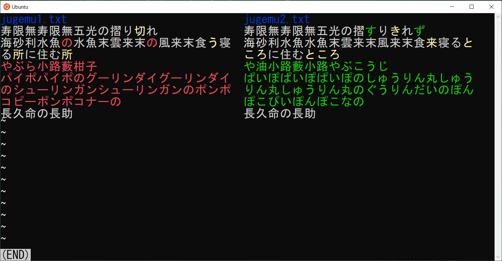
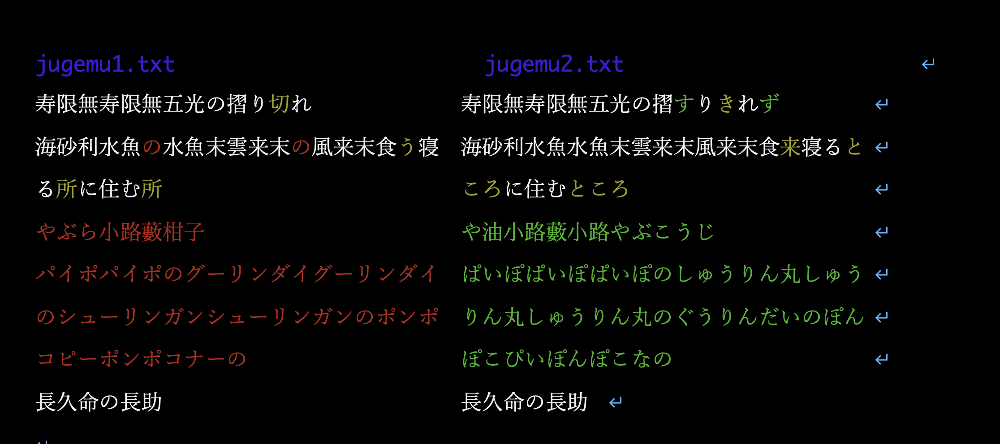
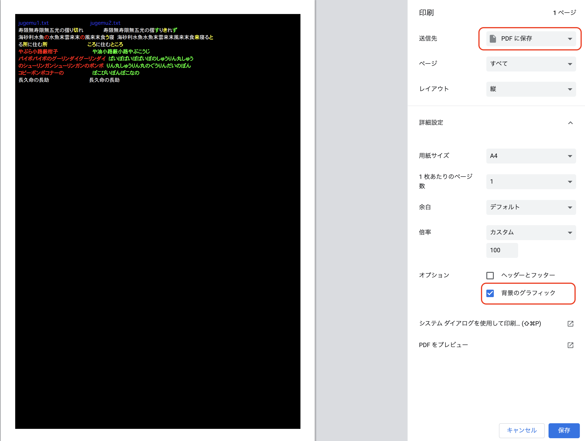

## TL;DR

ターミナルの色付きの出力(例えば色付きdiff等)をPDFとして保存するには、Wordに貼り付けるか、一度ahaでHTMLにしてからブラウザでPDFにすると良い。

## 何がやりたいか

ターミナルで色付きの結果が出て、それを色付きのまま保存したいことがある。典型的な例が色付きdiffだ。いま、ここに「寿限無」の二つのバリエーションがあったとして、その違いを見たいとする。

`jugemu1.txt` [寄席 正岡容 ー青空文庫ー](https://www.aozora.gr.jp/cards/001313/files/47599_58902.html)

```txt
寿限無寿限無五光の摺り切れ
海砂利水魚の水魚末雲来末の風来末食う寝る所に住む所
やぶら小路藪柑子
パイポパイポのグーリンダイグーリンダイのシューリンガンシューリンガンのポンポコピーポンポコナーの
長久命の長助
```

`jugemu2.txt` [糞尿譚 火野葦平 ー青空文庫ー](https://www.aozora.gr.jp/cards/001488/files/51168_53838.html)

```txt
寿限無寿限無五光の摺すりきれず
海砂利水魚水魚末雲来末風来末食来寝るところに住むところ
や油小路藪小路やぶこうじ
ぱいぽぱいぽぱいぽのしゅうりん丸しゅうりん丸しゅうりん丸のぐうりんだいのぽんぽこぴいぽんぽこなの
長久命の長助
```

単語単位のdiffを取りたいので、`icdiff`を使おう。

```sh
icdiff jugemu1.txt jugemu2.txt
```

すると、こんな出力を得る。


これを最終的にPDFで保存したいよね、という話。

## 案1: そのまま送る

PDFで保存するというのは、たいていの場合誰かに送りたいからだ。ならそのまま送れば良いじゃないか。リダイレクトしてみるとこうなる。

```sh
icdiff jugemu1.txt jugemu2.txt > diff.txt
```

普通に`less`で見るとこうなってしまう。


しかし、`-R`をつけてやれば読める。

```sh
less -R diff.txt
```



これで先程得られた通りの出力が得られる。もしくは、単に`cat`で画面に表示してしまっても、エスケープシーケンスを処理してくれる。簡易用途にはこれでも良い気がする。

## 案2: Wordに貼り付ける

使っているターミナルが、色付き出力をリッチテキストとしてコピーしてくれるなら、そのままWordに貼り付けらる。例えばMacのターミナルならそのままWordに色付きでコピペできる。端末の背景色とWordの背景色が異なると見づらいので、Wordの「デザイン」「ページの色」から、端末の背景色(例えば黒)を選ぶと良い。こんな感じになる。



あとはWordでPDFにエクスポートしてやれば良い。

ただし、WindowsのWSL2では書式付きでコピーできなかった。まぁ、一般的には書式なしコピーをしてくれた方がうれしいことが多いので、これは良し悪しか。

## 案3: ahaを使う

`aha`は、エスケープシーケンスをHTMLに変換してくれるツールだ。Ubuntuならaptで、Macならbrewで入る。

```sh
sudo apt install -y aha
```

```sh
brew install aha
```

あとは`icdiff`の結果を`aha`にリダイレクトしてやれば良い。`aha`はHTMLを標準出力に吐いてくれるので、それをファイルに保存する。端末の背景色が黒の場合は、`aha`に`--black`オプションをつけてやる。

```sh
icdiff jugemu1.txt jugemu2.txt | aha --black > diff.html
```

こんな感じのファイルになる。

`diff.html`

```html
<?xml version="1.0" encoding="UTF-8" ?>
<!DOCTYPE html PUBLIC "-//W3C//DTD XHTML 1.0 Strict//EN" "http://www.w3.org/TR/xhtml1/DTD/xhtml1-strict.dtd">
<!-- This file was created with the aha Ansi HTML Adapter. https://github.com/theZiz/aha -->
<html xmlns="http://www.w3.org/1999/xhtml">
<head>
<meta http-equiv="Content-Type" content="application/xml+xhtml; charset=UTF-8"/>
<title>stdin</title>
(snip)
         <span style="font-weight:bold;color:lime;">ぽこぴいぽんぽこなの</span>                   
長久命の長助                            長久命の長助                           
</pre>
</body>
</html>
```

あとはこれを好きな方法でPDFにすれば良い。例えばPandocを使う方法が考えられるが、[日本語を含むHTMLファイルをPandocで変換するのは結構面倒](https://qiita.com/sky_y/items/15bf7737f4b37da50372)なようだ。

というわけで、素直にブラウザで開いて、印刷からPDFに出力を選んでしまうのが楽だと思われる。

しかし、MacのChromeだとちょっとずれてしまう。



ちなみにそのままだと背景が白くなってしまうため、「背景のグラフィック」にチェックを入れておくと良い。

保存したPDFはこんな感じ。


ずれたままだ。

なお、WindowsのChromeで同じことをするとこうなる。


それほどずれはひどくない。

## まとめ

日本語を含む色付きターミナル出力を保存するには、MacではWordに貼り付けるのが、Windowsでは`aha`でHTMLにしてからブラウザでPDFに保存するのが良いと思われる。HTMLで保存するとちょっとずれてしまうが、頑張りたい人はHTMLのフォントをいじったりすれば良いのではないでしょうか。

しかし日本語がからむといろいろ面倒ですね。
