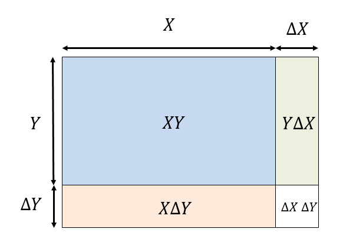

## 概要

誤差伝播の公式というものがある。なにか誤差がある量を加減乗除したときに、誤差がどのようになるか、ということを教えてくれる公式だ。例えば、いま$X$という量が、$\Delta X$という誤差を、$Y$という量が$\Delta Y$という誤差を持っているとき、その積である$XY$の誤差はどうなりますか？ということを問うのが誤差伝播である。

実験などでは、測定値の和や差より積を計算することが多いため、積の誤差伝播公式をよく使う。$X \pm \Delta X$と$Y \pm \Delta Y$の積は、

$$
\begin{aligned}
(X + \Delta X)(Y + \Delta Y)  &= XY + X\Delta Y + Y \Delta X + \Delta X \Delta Y  \\
&\sim XY + X\Delta Y + Y \Delta X 
\end{aligned}
$$

と$\Delta X \Delta Y$を高次の項として無視して、最終的に

$$
(X \pm \Delta X)(Y \pm \Delta Y) \sim XY \pm X\Delta Y + Y \Delta X
$$

と書き、$X\Delta Y + Y \Delta X$を誤差をみなす、というのが一般的だ。これは、以下のように面積図で説明されることが多い。

自分の誤差($\Delta X$)が、相方($Y$)によって引き延ばされる($Y \Delta X$)ようなイメージだ。

もしくは、テイラー展開による説明を聞いたかもしれない。ある変数$X$の関数$f(X)$について、$X$が$\Delta X$だけずれた影響は一次のテイラー展開で

$$
f(X+\Delta X) \sim f(X) + f'(X) \Delta X
$$

と書けるため、誤差$\Delta X$は$f'(X)$により引き延ばされる。今は、二変数なので$f(X,Y) = XY$として、二変数関数の一次のテイラー展開をすれば、同じ結果が得られる。

以上の説明は非常にわかりやすいのだが、テキストなどで、「以下の公式の方が正しい(より正確だ)」と説明されて混乱する人がいる。

$$
(X \pm \Delta X)(Y \pm \Delta Y) \sim XY \pm \sqrt{X^2\Delta Y^2 + Y^2 \Delta X^2}
$$

本稿では、上記の誤差伝播の公式をちゃんと導出して、なぜ後者の方が「良い」公式なのかを説明する。

## 誤差とはなにか

誤差という言葉が意味するものは難しい。たとえば実験で定規を使ってなにかの長さを測定したとき、メモリは1mmまでしかないが、目分量で0.1mmまで値を読みなさい、と指導されることがある。このとき、当然ながら0.01mm以下の長さについてはまったく情報がないし、0.1mmの値だって怪しいであろう。すると、全く同じものを別の人が測定した場合(もしくは同じ人が別の日に測定した場合)、値がばらつくことになる。

そこで、何度も測定して、その平均値を測定値としたくなる。例えば10回測定した平均値を考えるとき、さらに10回測定するとまた異なる平均値になるであろう。つまり、測定値を確率変数とみなすことができる。

以後、確率変数を$\hat{X}$のようにハットをつけて表現しよう。確率変数$\hat{X}$に対する期待値を$\left< \hat{X} \right>$とする。期待値は、以下のような線形性を満たす。

$$
\left< a \hat{X} + b \hat{Y} \right> = 
a \left<\hat{X}\right> + 
b \left<\hat{Y}\right>
$$

また、確率変数$\hat{X}$と確率変数$\hat{Y}$が独立である時、積の期待値が期待値の積で書ける。

$$
\left<\hat{X}\hat{Y}\right> = \left<\hat{X}\right>\left<\hat{Y}\right>
$$

ある確率変数$\hat{X}$について期待値$\mu_X$と分散$\sigma_X^2$を以下のように定義する。

$$
\begin{aligned}
\mu_X &\equiv \left< \hat{X} \right> \\
\sigma_X^2 &\equiv \left< (\hat{X} - \mu_X)^2 \right>
\end{aligned}
$$

このとき、標準偏差$\sigma_X$を「誤差」とみなし、$\hat{X}$の測定値$X$を

$$
X = \mu_X \pm \sigma_X
$$

と表記することを約束する。つまりここでは「誤差」を「測定値を確率変数とみなした場合の標準偏差」であるとする。

以上で準備が整った。我々は、平均値がそれぞれ$\mu_X, \mu_Y$、分散が$\sigma_X^2, \sigma_Y^2$であるような確率変数$\hat{X}$と$\hat{Y}$について、その期待値$\mu_{XY}$と分散$\sigma_{XY}^2$を求め、最終的に

$$
XY = \mu_{XY} \pm \sigma_{XY}
$$

と書きたい。簡単のため、平均値は正($\mu_X > 0,\mu_Y > 0$)であるとする。また、$\hat{X}$と$\hat{Y}$は独立であるとする。すると$\mu_{XY} = \mu_X \mu_Y$である。

したがって、求めたいのは$\sigma_{XY}$である。真面目に定義から計算しよう。

$$
\begin{aligned}
\sigma_{XY}^2 & \equiv \left< (\hat{X}\hat{Y} - \mu_X \mu_Y)^2\right>\\
&= \left<\hat{X}^2\hat{Y}^2\right> - 2\mu_X \mu_Y \left<\hat{X} \hat{Y}\right> + \mu_X^2 \mu_Y^2\\
&= \left<\hat{X}^2\right> \left<\hat{Y}^2\right> -\mu_X^2 \mu_Y^2\\
&= \mu_X^2 \sigma_Y^2 + \mu_Y^2 \sigma_X^2 + \sigma_X^2 \sigma_Y^2\\
&= \mu_X^2 \mu_Y^2 \left( \frac{\sigma_X^2}{\mu_X^2}+ \frac{\sigma_Y^2}{\mu_Y^2}+ \frac{\sigma_X^2}{\mu_X^2}\frac{\sigma_Y^2}{\mu_Y^2} \right) \\
&= \mu_X^2 \mu_Y^2 \left(\varepsilon_X^2+\varepsilon_Y^2+ \varepsilon_X^2\varepsilon_Y^2\right)
\end{aligned}
$$

ただし最後で、$\sigma_X^2/\mu_X^2 = \varepsilon_X^2$、$\sigma_Y^2/\mu_Y^2 = \varepsilon_Y^2$と表記した。

さて、もとの分布がどんなであれ、何度も測定を繰り返して平均値を計算すれば、その平均値の分布はガウス分布に近づき、サンプル数を増やすほどその分散が小さくなる(中心極限定理)。したがって、十分な回数の観測を行えば、平均値の絶対値に対して分散が十分に小さくなるであろう。いま、$\varepsilon_X$と$\varepsilon_Y$がどちらも$\varepsilon$のオーダーであるとし、$\varepsilon \ll 1$であるとしよう。すると$\varepsilon_X^2 \sim \varepsilon_Y^2 \sim \varepsilon^2$に対して$\varepsilon_X^2\varepsilon_Y^2$は $\sim \varepsilon^4$と高次の項になるため無視して良い。

以上から、

$$
\begin{aligned}
\sigma_{XY}^2 &\sim  \mu_X^2 \mu_Y^2 \left(\varepsilon_X^2+\varepsilon_Y^2\right)\\
&= \mu_X^2 \sigma_Y^2+\mu_Y^2 \sigma_X^2
\end{aligned}
$$

である。したがって、

$$
XY = \mu_X \mu_Y \pm \sqrt{\mu_X^2 \sigma_Y^2+\mu_Y^2 \sigma_X^2}
$$

これが「正確な方」の公式である。

さて、実用的には平方根が面倒なので外したい。

$$
\sigma_{XY}^2 =  \mu_X^2 \mu_Y^2 \left(\varepsilon_X^2+\varepsilon_Y^2\right)
$$

であったのを、右辺の括弧の中に$2 \varepsilon_X \varepsilon_Y$を足してやろう。すると平方完成することができる。

$$
\begin{aligned}
\sigma_{XY}^2 &=  \mu_X^2 \mu_Y^2 \left(\varepsilon_X^2+2 \varepsilon_X \varepsilon_Y+ \varepsilon_Y^2\right)\\
&= (\varepsilon_X + \varepsilon_Y)^2
\end{aligned}
$$

すると、最初に現れた方の公式

$$
XY = \mu_X \mu_Y \pm (\mu_X \sigma_Y + \mu_Y \sigma_X)
$$

が得られた。ここで注意したいのは、先ほど足した$\varepsilon_X \varepsilon_Y$は$\varepsilon^2$のオーダーであり、$\varepsilon_X^2,\varepsilon_Y^2$に対して無視できない量である。

簡単のため、$\mu_X=\mu_Y=\mu, \sigma_X = \sigma_X = \sigma$とすると、正確な方の公式の誤差は$\sqrt{2} \mu \sigma$、後者の公式は$2 \mu \sigma$となり、$\sqrt{2}$倍だけ誤差を過大評価している。

これは、後者の公式では、$X$と$Y$の平均値からのずれ方(ずれる方向)が同じであると仮定してしまっているからだ(最初の面積図を参照)。$X$が平均から大きくなる方向にずれた時、$Y$は平均から小さくなることもあるため、「誤差」は打ち消しあうこともある。それが$\sqrt{2}$倍の違いとして現れている。

## まとめ

測定値の積の誤差の伝播について、以下の二つの公式が用いられる場合がある。

$$
(X \pm \Delta X)(Y \pm \Delta Y) \sim XY \pm X\Delta Y + Y \Delta X
$$

$$
(X \pm \Delta X)(Y \pm \Delta Y) \sim XY \pm \sqrt{X^2\Delta Y^2 + Y^2 \Delta X^2}
$$

これは、測定値を確率変数だと思って、「誤差」を確率変数の標準偏差だと思うならば、後者の方が正確であり、前者は「誤差」を過大評価する。その理由は、前者が複数の変数が「同じように揺らぐ」と仮定してしまっているからだ。

しかし、実際の測定誤差は数%以下のオーダーであることが多く、それが1.4倍に評価されても大きな問題にならないことが多い。ちゃんとした論文であれば気を付けた方が良いが、学生実験くらいならあまり気にしなくて良いような気がする(とか書いたら怒られる？)。

## 関連記事

* [誤差伝播ライブラリを作った＆誤差伝播公式の導出 @ Qiita](https://qiita.com/kaityo256/items/a9cb57cc2c53eb8c5218)