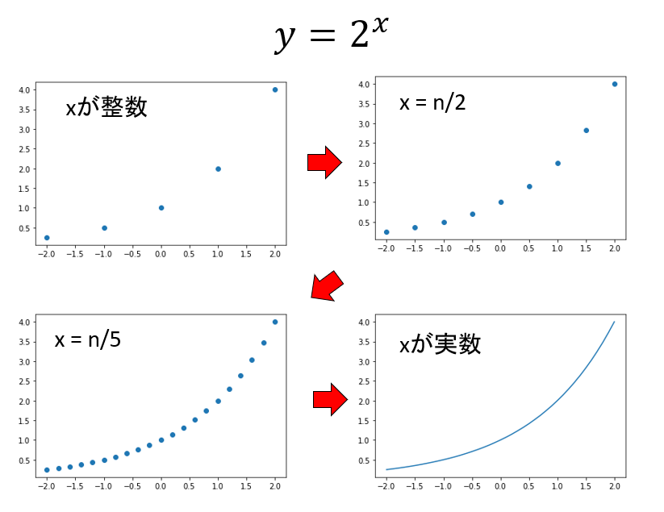

## はじめに

虚数単位$i$とは、自乗して-1になる数、つまり$i^2=-1$となる数として定義されます。虚数がからむ式として有名なのはオイラーの式

$$
e^{i \pi} = -1
$$

でしょう。ネイピア数$e$、円周率$\pi$、虚数単位$i$という「よくわからないもの」3つを組み合わせると-1になるという、とても不思議な式です。

さて、ネイピア数と円周率は実数です。したがって、$e^{i \pi}$は、実数の虚数乗になっています。$i^2=-1$は、虚数の実数乗でした。残る組み合わせ、「虚数の虚数乗」、つまり$i^i$はどんな数になるでしょうか？実は$i^i$は実数になります。値は不定ですが、主値を取ると$e^{-\pi/2} \sim 0.20787957$と、やはりネイピア数や円周率が出てきます。

なぜこうなるか？という証明はわりとネットに落ちているのですが、そこにたどり着く過程が面白いと思ったので、ちょっと記事にまとめてみます。以下、数学的にはわりといい加減なことを書くので、ガチ勢は曲がれ右ね。

## 指数法則

2を2回かけたものを$2^2$と表記することにします。2を3回かけたら$2^3$です。

$$
2^3 = 2 \times 2 \times 2
$$

さて、すぐにわかることは、$2^2$と$2^3$をかけると$2^5$になることです。

$$
\begin{aligned}
2^2 \times 2^3 &= \underbrace{2 \times 2}_{2^2} \times \underbrace{2 \times  2 \times 2}_{2^3}
&= 2^5
\end{aligned}
$$

以上から、自然数$a,b$に対して、$2^a \times 2^b = 2^{a+b}$が成り立つことがわかります。

次に、$2^3$に、さらにもう一度2^3$をかけてみましょう。

$$
2^3 \times 2^3 = 2^6
$$

です。また、同じものをかけているので指数の形でもかけます。

$$
2^3 \times 2^3 = (2^3)^2
$$

つまり、

$$
(2^3)^2 = 2^6
$$

です。以上から、自然数$a,b$に対して$(2^a)^b = 2^{ab}$が成り立つことがわかります。このような法則を指数法則と呼びます。

## 有理数への拡張

ここまでの議論では、$2^a$の$a$は自然数でした。これを0や負の数、有理数、そして無理数へと拡張していくのがこの記事の目的です。

割り算を考えましょう。$2^3$を$2^2$で割ると$2$になります。

$$
\begin{aligned}
\frac{2^3}{2^2} &= \frac{2 \times 2 \times 2}{2 \times 2}\\
&= 2
\end{aligned}
$$

ここから、$a>b$である自然数$a,b$に対して、$2^a/2^b = 2^{a-b}$が成立すると言えそうです。

さて、ここで$a=b$の場合を考えます。すると、分子と分母が一致しますから、値は1です。したがって、

$$
\frac{2^a}{2^a} = 2^{a-a} = 2^0 = 1
$$

以上から、任意の数の「0乗」は1である、と定義できそうです。指数のとり得る値として自然数から$0$を含む数へ踏み出せました。

では$a<b$の場合はどうでしょうか？例えば$a=2$、$b=3$の場合、

$$
\frac{2^2}{2^3} = \frac{1}{2}
$$

となります。ここで先程の法則$2^a/2^b = 2^{a-b}$が$a<b$の場合にも成り立つと考えると、

$$
2^{-1} = \frac{1}{2}
$$

となります。以上から、$1/2^a$を$2^{-a}$と表記できそうです。指数が「負の整数」まで拡張されました。

先程、$(2^a)^b = 2^{ab}$が成り立つことを見ました。いま、自乗したら$2$になるような数を考え、それを無理やり$2^a$と書いてみましょう。

$$
(2^a)^2 = 2^{2a} = 2 = 2^1
$$

ここから$2a=1$、つまり$a=1/2$であることがわかります。自乗して2になる数なので、これは2の平方根です。以上から

$$
\sqrt{2} = 2^{1/2}
$$

と定義できそうです。$m$乗根を考えれば

$$
\sqrt[m]{2} = 2^{1/m}
$$

です。さらにそれを$n$乗してやれば

$$
(\sqrt[m]{2})^n = 2^{n/m}
$$

です。以上から、指数のとり得る値として有理数全体まで広げることができました。

## 指数関数の定義

いま、$y = 2^x$という関数を考えましょう。最初は$x$は自然数でした。それが整数に拡張され、さらに有理数全体まで拡張が完了しました。これをグラフにプロットすれば、非常になめらかに見える関数が書けます。しかし、有理数全体は「すかすか」なので、これをなめらかにつないで「実数全体」に拡張したくなります。

実数を考えるということは、極限を考えること、つまり微分について考えることを意味します。つまり、$y = 2^x$という関数に対して、$x$に関する微分が定義できれば、$x$として実数全体に適用範囲を広げたことになります。

まず、$y = 2^x$や$y = 3^x$といった$x$乗の関数を$f(x)$と書きましょう。$2^x$と$2^y$をかけると$2^{x+y}$になるのでした。また、任意の数の0乗は1ですから、$f(0)=1$です。

この指数法則をちゃんと書くと

$$
\begin{aligned}
f(x)f(y) &= f(x+y)\\
f(0) &= 1
\end{aligned}
$$

です。これを全ての実数$x,y$で満たすような関数を構成するのが目的です。

さて、この二つの条件を満たす関数は無数にありますが、ここで条件を二つ付け加えます。まず、$f(x)$が任意の$x$に関して無限回微分可能であるとします。これは、たとえば$y=2^x$において、$x$が有理数全体で定義されていたものを、なめらかにつないだ関数を考える、ということです。ここまででは$y=f(x)$として$2^x$も$3^x$も条件を満たしますが、もう一つ、$x=0$における微係数が$1$、つまり

$$
f'(0) = 1
$$

となることを要請しましょう。この条件により、関数$f(x)$が一意に決まります。条件をもう一度まとめると、

$$
\begin{aligned}
f(x)f(y) &= f(x+y)\\
f(0) &= 1\\
f'(0) &= 1
\end{aligned}
$$

を満たす連続な(無限回微分可能な)関数$f(x)$を考えます。すると、微分の定義から$f'(x) = f(x)$、つまり微分しても自分自身に戻ることが証明できます。

$$
\begin{aligned}
\frac{d}{dx}f(x) &= \lim_{h\rightarrow 0} \frac{f(x+h) - f(x)}{h} \\
&= \lim_{h\rightarrow 0} \frac{f(x)f(h) - f(x)}{h} \\
&= f(x) \lim_{h\rightarrow 0} \frac{f(h) - 1}{h} \\
&= f(x) \lim_{h\rightarrow 0} \frac{f(h) - f(0)}{h} \\
&= f(x) f'(0)\\
&= f(x)\\
\end{aligned}
$$

途中で指数法則$f(x+h) = f(x)f(h)$や、$f'(0)=1$を使いました。ここから

$$
f(0) = f'(0) = f''(0) = \cdots =f^n(0) = 1
$$

がわかります。さて、無限回微分可能であることを要請したので、$x=0$まわりでテイラー展開できます。

$$
f(x) = \sum_{n=0}^{\infty} \frac{f^n(0)}{n!} x^n
$$

いま、全ての$n$について$f^n(0)=1$なので、

$$
f(x) = \sum_{n=0}^{\infty} \frac{x^n}{n!}
$$

です。このテイラー展開で表現される関数を指数関数と呼び、$\exp(x)$で表します。この関数に$x=1$を代入した値を$e$と書きましょう。

$$
\exp(1) \equiv e
$$

この$e$をネイピア数と呼びます。すると、

$$
\exp(x) = e^x
$$

と表すことができます。$\exp(x)$は実数全体で定義したので、実数$x$に対して$x$乗する操作を定義できました。指数関数はもともとの定義から、指数法則を満たします。さらに実数全体に拡張したので、微分できるようになりました。$x=0$における微分係数が$1$であるべし、という条件から、微分しても自分自身に戻ります。

$$
\frac{d}{dx} e^x = e^x
$$

## 対数関数の定義

さて、ネイピア数$e$を導入し、実数全体に対して$e^x$を定義できました。次に$2^x$とか$3^x$など、任意の数の$x$乗を定義したくなります。そのために、対数関数を定義しましょう。

対数関数$\log(x)$を指数関数の逆関数として定義します。つまり、

$$
x = \exp(y)
$$

である時、これを$y$について解いて

$$
y = \log(x)
$$

とします。これが対数関数です。$x = \exp(y)$を両辺自乗してやりましょう。

$$
x^2 = \exp(2y)
$$

逆に解けば、

$$
2 y = \log(x^2)
$$

もともと$y = \log(x)$でしたから、

$$
\log(x^2) = 2 \log(x)
$$

です。一般に、

$$
\log(x^a) = a \log(x)
$$

が成り立つことがわかります。また、$\exp(1) = e$というのがネイピア数の定義でしたから、

$$
e = \exp(1)
$$

より、

$$
\log(e) = 1
$$

です。このように決めた対数関数を「自然対数」と呼びます[^log]。

[^log]: 自然対数を$\ln$、常用対数$\log$と書く流儀もありますが、ここでは自然対数しか出てこないため$\log$を自然対数とします。

対数関数を導入すると、$2^x$を$e^x$の形で書き直すことができます。$2^x$の対数を取ると、

$$
\log(2^x) = x \log(2)
$$

さて、$\log(e) = 1$でしたから、

$$
\log(2^x) = x \log(2) \log(e)
$$

$x\log(2)$を改めて$a$と表記すると

$$
\begin{aligned}
\log(2^x) &= a \log(e) \\
&= \log(e^a)
\end{aligned}
$$

以上から、

$$
2^x = e^{x \log 2}
$$

であることがわかりました。これを底の変換と呼びます。これで任意の実数$a,x$について、$a^x$が定義できました。

## 複素数への拡張

ここまでで、任意の実数$a,x$について、$a^x$が定義できました。次に、$x$を複素数に拡張したくなります。そのためには指数関数$\exp(x)$の引数に複素数を突っ込めるようにしなければなりません。指数関数$\exp(x)$は

$$
\begin{aligned}
\exp(x)\exp(y) &= \exp(x+y)\\
\exp(0) &= 1\\
\left. \frac{d}{dx}\exp(x)\right|_{x=0} &= 1
\end{aligned}
$$

を満たす無限回微分可能な関数として定義しましたが、このままでは虚数や複素数を突っ込んだらどうなるかがわかりません。そこで、テイラー展開を考えます。指数関数のテイラー展開は以下のようになるのでした。

$$
\exp(x) = \sum_{n=0}^{\infty} \frac{x^n}{n!}
$$

これを、指数関数の「定義」として採用します。すると、$x$に複素数を突っ込むことができるようになります[^matrix]。

[^matrix]: テイラー展開を関数の定義として採用することで、$x$として行列や微分演算子なども突っ込めるようになります。

特に$\exp(ix)$を考えると、

$$
\exp(ix) = \sum_{n=0}^{\infty} \frac{(ix)^n}{n!}
$$

とあります。$ix$の偶数乗は実数となり、奇数乗は純虚数となることから、実部と虚部に分けて整理すると、オイラーの公式

$$
\exp(ix) = \cos(x) + i \sin(x)
$$

を得ることができます。

例えば、$x=\pi$を入れると、

$$
\exp(i\pi) = \cos(\pi) + i \sin(\pi) = -1
$$

となります。対数関数は指数関数の逆関数ですから、$\log(-1)$とは、「指数関数$\exp(x)$の値が-1である時、xの値は何ですか？」という問いになり、この場合は$i\pi$でしたから

$$
\log(-1) = i \pi
$$

となります。しかし、三角関数は周期関数であり、引数に整数$n$に対して$2n\pi$を足しても同じ値になります。つまり、

$$
\exp(i(\pi+2n\pi)) = \cos(\pi+2n\pi) + i \sin(\pi+2n\pi) = -1
$$

ですから、

$$
\log(-1) = i (2n + 1)\pi 
$$

となります。つまり、指数関数は虚軸方向には周期関数であることを反映して、対数関数が多価関数になります。これだと不便なので、代表的な値を「主値」と定め、一つの値で代表させることにします。ここでは先程の式の$n=0$の場合を主値として、

$$
\log(-1) = i\pi 
$$

を採用しましょう。

## 虚数の虚数乗

さて、長い道のりでしたが、ようやく虚数の虚数乗を定義する準備ができました。我々が知りたいのは$i^i$です。底の変換公式から、

$$
i^i = \exp\left(i \log(i)\right)
$$

となります。$\log(i)$とは、$\exp(x) = i$となるような$x$のことですから、オイラーの公式

$$
\exp(ix) = \cos(x) + i \sin(x)
$$

から、$\cos(x) = 0$、$\sin(x) = 1$となるような$x$です。これは$n$を整数として

$$
x = i\left(\frac{\pi}{2} + 2n\pi\right)
$$

です。

$$
\log(i) = i\left(\frac{\pi}{2} + 2n\pi\right)
$$

です。両辺に$i$をかけると、

$$
i\log(i) = -\left(\frac{\pi}{2} + 2n\pi\right)
$$

これを指数関数に突っ込むと、

$$
i^i = \exp\left(-\left(\frac{\pi}{2} + 2n\pi\right)  \right)
$$

主値($n=0$)を取ると、

$$
i^i = \exp\left(-\frac{\pi}{2}\right)\sim 0.20787957
$$

これが欲しかった値でした。

## まとめ

虚数の虚数乗$i^i$を計算するために、わりと長い旅が必要でした。もともと指数とは「2を$n$回かけたものを$2^n$と書く」のように、$n$は1,2と数えられる数、すなわち自然数でした。それを、指数法則から$0$や負の数まで拡張しました。「1,2,3,...」と数えられる自然数に対して、なにもない「0」や、負の数の概念は不思議です。例えば「-3本の鉛筆」を手にとって見せることはできません。例えば「誰かに鉛筆を3本借りている状態」を、「-3本の鉛筆を持っている状態」と「定義」することになります。さらに、有理数に拡張すると「1/2本の鉛筆」みたいな概念があらわれます。そこまではまだイメージできるとしても、「$\sqrt{2}$本の鉛筆」だといろいろ怪しくなってきて、「$i$本の鉛筆」になるともう想像することはできないでしょう。

数学はこのように、「何かが満たす関係式を導出し、逆にその関係式を定義だと思って適用範囲を広げる」ということをよくやります。この$i$の$i$乗は、典型的な「どんどん適用範囲を広げましょう」というパターンだと思ったので、簡単に紹介してみました。

ここでの議論はかなりいい加減で、本当は何かを級数で定義したら、それは収束するのか、収束するならどの範囲で収束するのか、微分とは何か、連続とは何か、といったことを真面目に議論しなければいけません。そのあたりは大学の初等関数論でしっかり学んでください。

## 合わせて読みたい

* [三角関数の話](https://zenn.dev/kaityo256/articles/trigonometric_function)
* [線形代数を学ぶ理由](https://qiita.com/kaityo256/items/872a2b2fdf977c0e3fbb)