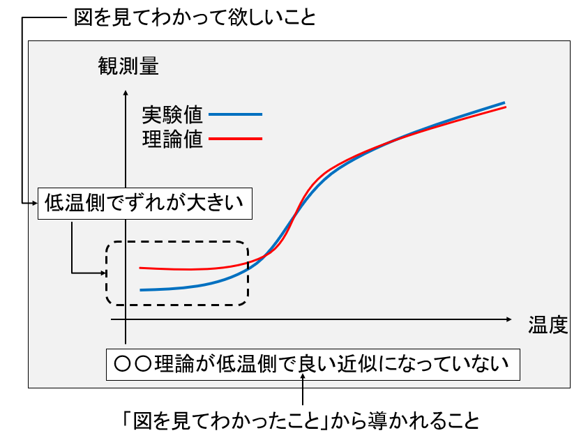

## はじめに

学生さんは、卒論や修論など、成果発表の場が結構あると思います。その際にどんなことに気を付ければ良いのかをまとめてみました。以下は主に理工系の、10分程度の研究発表を想定しますが、技術発表や学会発表なんかも共通するところは多いと思います。

以前に書いた以下のスライドも参考にしてください。

* [研究発表の仕方](https://speakerdeck.com/kaityo256/happy-presentation) 以下の内容はほとんどこのスライドについて説明したものです
* [卒論の書き方](https://speakerdeck.com/kaityo256/happy-writing) こちらも参考になるかもしれません。

## 発表の目的

研究発表の目的は、科学技術において自分がどんな貢献をしたのかを聴衆に説明することです。ここで大事なのは、「科学技術において」の部分と、「自分がどんな貢献をしたのか」の二点です。研究発表の目的は自分の研究のオリジナリティを主張することですが、オリジナリティを主張するためには、研究背景をしっかり共有しなければなりません。つまり、既存の知識でどこまでがわかっており、既存の技術でどこまでできていて、何が不明な点、不満な点として残っているのかをしっかり説明しなければ、オリジナリティを共有することができません。

一般に、その研究が重要であればあるほど、研究の歴史が長く、先行研究も数多くあります。その中で、「大きな一歩」を踏み出すのは極めて難しく、多くの場合、その研究発表は「小さな一歩」となるでしょう。その「小さな一歩」をしっかり説明するためには、研究の目的、背景をしっかり説明する必要があります。そのためには、先行研究となる論文などをしっかり読み込んで、研究の流れを頭にいれておき、「全体の研究の流れに対して自分の貢献をしっかり位置付ける」ことが大事になってきます。

また、研究発表は、何か不満があり、それを解決する、という形を取ります。したがって、発表の最初に「現状の不満」を聴衆と共有し、最後に確かにその不満が解決/軽減されたことを主張する必要があります。この「不満の共有」と「その解決」は必ずセットです。たまに研究の目的と、結果の考察がかみ合っていない発表が見受けられます。細かい話を作る前に、まずは「大きなストーリー」をしっかり作りましょう。

## スライドの作り方

まず、発表は以下のような要素から構成されます。

* 背景：なぜこの研究が必要か
* 目的：最終的に何がしたいか
* 手法：どうやってそれを実現するか
* 結果：どんな結果が出たか
* 考察：それはどんな意味を持つか
* まとめ：何をしたか、次はどこへ向かうか

発表スライドですが、目安は「1分1枚」です。10分の発表であれば、10枚～15枚程度でしょう。20枚は明らかに多すぎます。それを考えると、要素と枚数の対応はだいたい以下のようになります。

* 背景：1～2枚
* 目的：1～2枚
* 手法：2～3枚
* 結果+考察 合わせて2～3枚
* まとめ：1枚

以下、それぞれの要素について説明します。

### 研究背景

学生さんの発表を見ていて、わりとおろそかになっていることが多いのがこの「研究背景」です。発表の最初に、まず「自分がこれから発表する研究**分野**が重要である」ことを聴衆に納得させなければなりません。学科の研究発表でも、専門が異なる研究室が集まっていることが多いため、まずは「なぜその分野が重要なのか」を共有する必要があります。そのためには、誰もが納得しそうな「大きな理由」から入ると良いでしょう。例えば「エネルギー問題は大事だよね」とか「病気の早期発見って重要だよね」といった「大きな目的」に疑問を抱く人は少ないでしょう。そこから自分の研究分野である「小さな目的」へつなぎます。

例えば、「エネルギー問題を解決したい」という大きな目的を掲げ、次に、その解決手段として「高効率な燃料電池を開発したい」とつなぎます。燃料電池であればいきなり「高効率な燃料電池を開発します」といってもそれなりに通じるとは思いますが、一般の人があまり知らないデバイスの高効率化を目指す研究なら、そのデバイスは何をするもので、高効率になるとどんな「大きな問題」が解決するのかを説明するところから入らなければなりません。

### 目的

研究背景では、先行研究と、現状の不満点を話します。「大きな目的」がみんなが納得するものであるなら、他にもその問題を解決しようとしている人たちがいるはずです。それまでにどんな研究がなされて、どこまで問題が解決しているかを説明した後、**先行研究に置ける不満点** を説明します。この不満点の解決/軽減を目指すのが発表の主要なテーマとなるので、不満の共有は非常に重要です。そして、その問題点をこの発表で解決することを宣言します。

なお、「高効率化」や「高精度化」などの「ある指標の向上を目指す研究」では、目標となる数値とその根拠の明示が重要です。単に「現状では効率80%だったが、今回の研究で83%まで向上できた」という発表では、そもそも「なぜ80%ではダメなのか」「83%になることで何がうれしいのか」を聴衆と共有できません。「現状では効率80%だが、Aという目的のためには90%は欲しい。本研究では83%まで向上できたので、Aには至らなかったが、Bという目的には使えるようになった。今後はAを目指して効率の向上を目指す」といった「ストーリー」を作る必要があります。

いずれにせよ、ここで提示した「不満点」を最後の「考察」や「まとめ」で受けるので、自分の頭のなかできちんと対応しているか、**スライドを作り始める前に** ストーリーを確認しておくと良いでしょう。

### 手法

自分の発表しようとしている研究分野の重要性と、現状の問題点について聴衆と共有できたとしましょう。次は手法の説明です。手法は、先に提示した「問題点」を解決する手段であり、もっともオリジナリティが重視される部分です。したがって、先行研究との違いを明確にする必要があります。特に、先行研究と比べたメリットとデメリットはもちろん、「なぜその手法がこれまで採用されてこなかったのか」を説明しなければなりません。例えば「昔は計算能力が足りなかったが、いまなら使える」「致命的な問題があったが、別の手法により解決した」「別の分野で使われている手法だが、この分野に使えるとは思われていなかった」など、新手法が有用であるほど、なぜその手法がこれまで誰も思いつかなかったのか、それとも思いついたけど何か困難があって使えなかったのかなどを説明する必要があります。

さらに、発表で重要なのは「オリジナリティの主張」であって、「自分の苦労を主張」することではありません。研究のオリジナリティと、研究で最も苦労した(時間をつかった)箇所は一般に一致しません。つい「自分が最も苦労したところ」を重視して説明しがちですが、「研究の流れ」のなかでもっとも重要と思われるところに重点を置いて説明してください。例えば、あるデバイスにはAという材料が使われているが、高温での劣化が激しいという弱点があったとします。Bという材料を使うと高温でも劣化しないことが期待されますが、Aほどの性能が出せないとしましょう。そこで、Cという材料をドープすることで、Bの「高温でも劣化しにくい」という性質をキープしつつ、Aに近い性能を引き出すことを研究の目的とします。さて、Cをドープすると結晶成長が難しく、実験の大半が合成条件探索に費やされたとします。すると、「どうやって合成条件を探したか」の苦労話をしたくなります。しかし、研究のオリジナリティは「Cをドープする」という点にあり、あくまでも「なぜCをドープしようと思ったか」「なぜCをドープすると性能が良くなると期待されるのか」をメインに話さなければなりません。また、数値計算において、勘違いでなかなか結果が出なかった話などは本筋とは関係がありません。もちろんデバッグの苦労などもすべきではありません。手法パートは「問題を解決する手段の説明パート」であり、「苦労話パート」ではないことに注意しましょう。

### 結果と考察

論文や長い発表では結果と考察を分けることもありますが、短い発表では、結果と考察はまとめた方がよいでしょう。二つの実験結果A, Bがある時、「結果 A,B」「考察 A,B」の二枚のスライドにまとめるのではなく「結果A, 考察A」「結果B, 考察B」とまとめた方がわかりやすいと思います。原則として、聴衆が過去のスライドを覚えていることを前提としてはいけません。一つの話は一つのスライドで完結するように話すようにしましょう。

#### 図の入れ方

結果はグラフなどを使って視覚的に説明することがほとんどだと思います。この際、「1スライド1メッセージ」を原則とします。一つのスライドに二つ以上のメッセージを込めると聴衆が混乱します。

図の役割は主に比較です。例えば以下のような比較が考えられます。

* 理論値と実験値の比較(合っている/合っていない)
* 提案手法と既存手法の比較(性能が向上した/していない)
* パラメータ領域による比較、例えば高温と低温、高密度と低密度など

比較したいものを一つの図にまとめましょう。

図を入れた時、その図を見てわかることと、その意味を両方スライドに書き込むと良いでしょう。例えば、高温側で理論値と実験値が良く一致している一方、低温側でずれが大きいグラフがある時、口頭で説明するだけでなく、「低温側でずれが大きい」と図に書き込むことで、聴衆は「あ、このずれを見て欲しいんだな」とわかります。さらに、図の下に「〇〇理論が低温側で良い近似になっていない」などと、「「図を見てわかったこと」から導かれること」を書いておくと、聴衆は口頭説明無しでも、このスライドの「言いたいこと」がわかりやすくなります。また、発表者も言いたいことのいい忘れを防ぐことができます。

#### パラメータや記号を使わない

あまりよくない発表でよくあるのが、実験サンプルに「サンプル1、サンプル2」などと名前を付けて「サンプル1の場合は〇〇ですが、サンプル2の場合は・・・」と話してしまうものです。当然、サンプル1,2がそれぞれどういうものかはスライドで説明されますが、聴衆はそれを記憶しておかなければ話についていけなくなります。繰り返しとなりますが、聴衆が過去のスライドを覚えていることを前提としてはいけません。「高温条件で作ったサンプルは〇〇ですが、低温条件で作ったサンプルは・・・」などと説明するようにしましょう。

また、数値計算の発表でよくあるのが、パラメータを変えたときにどのように振る舞いが変わるかを説明しようとして「A=1の場合は〇〇ですが、A=10とすると・・・」と変数名で話してしまうものです。これも「摩擦が弱い場合は〇〇ですが、摩擦を強くすると・・・」などと、パラメータが表す性質を使って説明するようにしましょう。パラメータを変化させる場合は、何かを比較したいはずですので、何と何を比較しているのか分かりやすいように話しましょう。スライドもグラフに「A=1」「A=10」と書くのではなく「弱い摩擦(A=1)」「強い摩擦(A=10)」などと書くと親切です。

### まとめ

発表の最後のスライドは「まとめ」とします。「ご清聴ありがとうございました」というスライドは作らない方が良いでしょう。「まとめ」には、「研究のまとめ」と「今後の展望」を書きます。

「研究のまとめ」は、本研究で何を目的に何をしたか、その結果何が得られて、それはどのような意味を持つかを簡潔に書きます。この結果が、発表冒頭で聴衆と共有した「不満」の解消になっているかを確認しましょう。

例えば、「手法Xの精度に不満がある」のなら、「手法Xの精度を向上する」のが目的となります。「手法Xの精度が出ない理由を解明した」では目的と結果が対応しません。「精度がでない理由を解明した」を結果としたいなら、目的は「精度がでない理由を知りたい」にしなければならず、そのためには聴衆と「精度が出るはずなのに出ない」という問題点を共有しなければならないため、発表のストーリーが大きく変わります。

忘れがちですが、「今後の展望」は必ず書きます。ほとんどの場合において、研究がこれで終わる、ということはありません。長い長い道のりを歩いてきて、今回の研究で一歩を踏み出したけれど、まだ先に長い長い道がある、という場合がほとんどでしょう。そこで、「本研究で踏み出した一歩」の「次の一歩」をどう踏み出すべきかを発表の最後に説明します。この「今後の展望」を書くためには、「これまでの研究の流れ」をしっかり理解しておかなければなりません。ちゃんと先行研究をあらって、自分の研究が大きな「研究の流れ」のどこに位置付けられるのか、しっかり把握しましょう。

## 発表練習について

発表は時間が決まっています。時間通りに話すのはかなり難しいことであり、練習が必要です。必ず時間を測って、なんども練習しましょう。

発表原稿を用意して、それを読み上げる人もいますが、私はあまり推奨しません。原稿は用意しても良いですが、練習でそれを丸暗記し、本番ではスライドだけで話すようにすると良いでしょう。

原稿を用意してしまうと、発表者が原稿に頼って話してしまうため、スライドがおざなりになってしまうことが多いです。原稿を見ずにスライドだけで話せるようにしておくと、自然とスライドも分かりやすいものになります。少なくとも、重要事項がスライドに記載されていない、といった事態を防ぐことができます。

発表は、対面であれば聴衆の方を向いて、聴衆を見ながら話すようにしましょう。また、昨今ではオンラインでの講演も増えてきました。その場合は、カメラを見ながら話しましょう。いずれにせよ、聴衆の顔を見て、自分の言いたいことが伝わっているか、その表情から読み取ろうとする努力が重要です。

発表練習をしてみて、スライドがいったりきたりしてしまうのは準備不足です。原則としてスライドは順番にめくります。もしどうしても途中で戻らなければならない場合は、スライドの構成を再検討すべきです。

## 審査について

### 審査員の心構え

発表は、審査員や、それに近い立場の人がいることが多いです。例えば卒論発表、修論発表なら先生が、コンテストなら審査員がいます。審査員の心構えとして重要なのは、「コメントは教育効果を考えてすべき」というものです。

発表を審査する場合、目的は「次により良い発表をしてもらうこと」です。そのため、ダメだしをするなら「何がダメか」を伝えるだけはなく「それはなぜダメか」と「どうすれば良くなるか」をセットでフィードバックする必要があります。

一番まずいのは「どこが悪いかわかる？」と発表者に聞くパターンです。これを繰り返すと、発表者は「良い発表をする」よりも、「審査員の顔色を読む」ことを目的としてしまい、教育という面で極めてマイナスになります。最初から「ここがこう悪かったから、こうすると良い」と、ダメな点とその理由と改善方法をセットでフィードバックするようにしましょう。

また、審査員は原則として感情を露わにしてはいけません。感情を出して良いのはポジティブな場合、たとえば「面白いね」「すごいね」といったものだけです。審査員がネガティブな感情を露わにすると、発表者が「発表の場」を怖がるようになります。それは卒論/修論発表のような参加義務の場でもマイナスですし、コンテストのような任意参加の場では、参加者が減るなど分野に対して大きなマイナスとなります。

「審査員は発表者の発表をよりよくするためのフィードバックをするためにいる」ことを意識し、発表者を委縮させることのないように心がけましょう。

### 発表者の心構え

卒論発表など、参加義務の発表ではかなり緊張することでしょう。また、怖い先生から厳しいコメントをもらって凹むこともあるかもしれません。しかし、教員や審査員の評価が絶対ではない、ということは心に留めておいてください。

審査員は発表者よりも経験を積んでいることが多く、一般論としては学生よりも精度が高いフィードバックをできる可能性が高いです。しかし、コメントはその人の哲学や価値観などは自身のバックグラウンドにどうしてもひっぱられます。「発表はこうあるべき」「研究はこうあるべき」という強い哲学を持っている審査員からのフィードバックをもらった時は、参考にしつつも、あくまでも「その教員の哲学、価値観に基づいたフィードバックであり、世界標準ではない」ということを意識しておいてください。別の場所では別の価値観があるかもしれません。

発表は、審査員の価値観を推定するゲームではありません。無難に終わるに越したことはないですが、何か琴線に触れて強い口調でフィードバックをもらった場合でも、ちゃんと準備していたのならあまり気にすることはありません。

## おわりに

主に10分程度の研究発表において気を付けるべきことをまとめて見ました。言うまでもないことですが、本稿も筆者のバックグラウンドに依存する価値観に基づいたものであり、分野によって異なる基準や習慣があることでしょう。

いずれにせよ、発表とそのフィードバックは、「発表者が次により良い発表をするため」に、ひいては「その分野がより発展するため」にあります。その目的を発表者、審査員で共有し、有益な場となると良いな、と思います。
