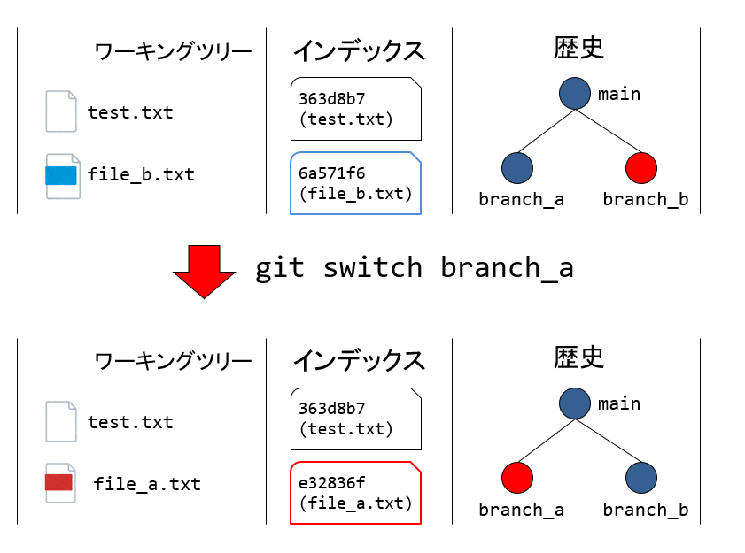

## はじめに

Gitは、commitをする前にaddをする必要があります。これをステージングといいます。このステージングされる場所をインデックスといいます。実体は`.git/index`というファイルです。これがどういうファイルかちょっと見てみましょう、という記事です。

## インデックス

### init直後

とりあえずインデックスを見てみましょう。適当なディレクトリを掘って、そこにファイルを作り、`git init`します。

```sh
mkdir index_test
cd index_test
echo "My first file" > test.txt
git init
```

さて、`git init`した直後は、まだ`index`は作られていません。

```sh
$ tree .git
.git
├── HEAD
├── config
├── description
├── hooks
│   ├── applypatch-msg.sample
│   ├── commit-msg.sample
│   ├── fsmonitor-watchman.sample
│   ├── post-update.sample
│   ├── pre-applypatch.sample
│   ├── pre-commit.sample
│   ├── pre-merge-commit.sample
│   ├── pre-push.sample
│   ├── pre-rebase.sample
│   ├── pre-receive.sample
│   ├── prepare-commit-msg.sample
│   ├── push-to-checkout.sample
│   └── update.sample
├── info
│   └── exclude
├── objects
│   ├── info
│   └── pack
└── refs
    ├── heads
    └── tags

8 directories, 17 files
```

また、この時点で`git diff`しても何も表示されません。

### add直後

`git add`することで`index`が作られます。

```sh
$ git add test.txt
$ tree .git
.git
├── HEAD
├── config
├── description
(snip)
├── index
├── info
│   └── exclude
├── objects
│   ├── 36
│   │   └── 3d8b784900d74b3159e8e93a651c0db42629ef
│   ├── info
│   └── pack
└── refs
    ├── heads
    └── tags

9 directories, 19 files
```

`head`が作られ、`objects`の中に、`36`というディレクトリが作られ、その中に`3d8b784900d74b3159e8e93a651c0db42629ef`というファイルができました。

さて、この状態でも、`git diff`は何も表示しません。

```sh
$ git diff
$
```

ここまで、何が起きたのでしょうか？

まず、`git add`することで、そのファイルのblobオブジェクトが作られ、インデックスに登録されます。インデックスの中身は、`git ls-files --stage`で見ることができます。

```sh
$ git ls-files --stage
100644 363d8b784900d74b3159e8e93a651c0db42629ef 0    test.txt
```

`test.txt`というファイルに対応するblobオブジェクトができています。そのハッシュは`363d8b784900d74b3159e8e93a651c0db42629ef`です。このオブジェクトを調べるには、`git cat-file`を使います。`-t`でタイプが、`-p`で中身を見ることができます。

```sh
$ git cat-file -t 363d8b784900d74b3159e8e93a651c0db42629ef
blob
$ git cat-file -p 363d8b784900d74b3159e8e93a651c0db42629ef
My first file
```

ハッシュ`363...`を持つオブジェクトがblobオブジェクトであり、その中身が`My first file`であることがわかります。つまり、インデックスには`test.txt`に対応するblobオブジェクトが入っています。`test.txt`のハッシュは`git hash-object`で得ることができます。

```sh
$ git hash-object test.txt
363d8b784900d74b3159e8e93a651c0db42629ef
```

つまり、`git add test.txt`をした時、Gitは

* `test.txt`に対応するblobオブジェクトを作り、ファイル名はハッシュとする
* 作られたオブジェクトは`.git/objects`に保存。ただし、ハッシュの上二文字をディレクトリとし、残りをファイル名として仕分けする
* `index`にそのblobオブジェクトと名前を登録する

ということをしています。

また、`git diff`は、引数なしだと「インデックスにあるファイルとワーキングツリーのファイルを比較する」ので、インデックスが空なら何も表示せず、`git add`直後は、インデックスとワーキングツリーのファイルが一致しているので、やはり何も表示しません。

### commit直後

さて、コミットしてみましょう。

```sh
$ git commit -m "Initial commit"
[main (root-commit) fc4050c] Initial commit
 1 file changed, 1 insertion(+)
 create mode 100644 test.txt
```

無事にコミットされ、`fc4050c`というコミットオブジェクトが作られました。


`.git`がどうなっているか見てみましょう。

```sh
$ tree .git
.git
├── COMMIT_EDITMSG
├── HEAD
(snip)
├── index
├── info
│   └── exclude
├── logs
│   ├── HEAD
│   └── refs
│       └── heads
│           └── main
├── objects
│   ├── 36
│   │   └── 3d8b784900d74b3159e8e93a651c0db42629ef
│   ├── b4
│   │   └── 0d873c372b28782e7bef9ab962a971b43fc1ca
│   ├── fc
│   │   └── 4050c6ff60e688e052f12fdccec760d0a27503
│   ├── info
│   └── pack
└── refs
    ├── heads
    │   └── main
    └── tags

14 directories, 25 files
```

objectsが3つに増えています。また、`logs`というディレクトリも作られました。まずはこの3つのオブジェクトを見てみましょう。

1つは先程のblobオブジェクト`363d8b7`でした。もう1つの`fc4050c`はコミットオブジェクトです。

```sh
$ git cat-file -t fc4050c
commit
```

中身を見てみましょう。

```sh
$ git cat-file -p fc4050c
tree b40d873c372b28782e7bef9ab962a971b43fc1ca
author H. Watanabe <kaityo256@example.com> 1628835374 +0900
committer H. Watanabe <kaityo256@example.com> 1628835374 +0900

Initial commit
```

コミットメッセージと、treeオブジェクト`b40d873`を含んでいますね。これがtreeであることを確認し、中身も見てみましょう。

```sh
$ git cat-file -t b40d873
tree
$ git cat-file -p b40d873
100644 blob 363d8b784900d74b3159e8e93a651c0db42629ef    test.txt
```

`test.txt`に対応するblobオブジェクトを一つだけ含んでいました。

以上から、ファイル一つだけのリポジトリを作り、コミットした直後には、

* ファイルに対応するblobオブジェクト
* コミットに対応するcommitオブジェクト
* コミットの中にあるtreeオブジェクト

の3つのオブジェクトが作られることがわかりました。先程、`objects`ディレクトリに3つあったのはこれです。

## ブランチ切り替えとインデックス

`git diff`は、デフォルトでワーキングツリーとインデックスの内容を比較するのでした。では、ブランチを切り替えると、インデックスはどうなるのでしょうか？

まずはブランチ`branch_a`を切って、そこに`file_a.txt`を追加、コミットします。

```sh
$ git checkout -b branch_a
Switched to a new branch 'branch_a'
$ echo "This is A" > file_a.txt
$ git add file_a.txt
$ git commit -m "adds file_a.txt"
[branch_a 41e4b52] adds file_a.txt
 1 file changed, 1 insertion(+)
 create mode 100644 file_a.txt
```

これで、ワーキングツリーには`test.txt`と`file_a.txt`の二つのファイルが含まれるようになりました。当然、インデックスにも同じファイルが登録されています。

```sh
$ git ls-files --stage
100644 e32836f4cedd87510bfd2f145bc0696861fdb026 0    file_a.txt
100644 363d8b784900d74b3159e8e93a651c0db42629ef 0    test.txt
```

`file_a.txt`のblobオブジェクトが増えていますね。ハッシュも確認しておきましょう。

```sh
$ git hash-object file_a.txt
e32836f4cedd87510bfd2f145bc0696861fdb026
```

同じです。

この状態で、ブランチを切り替えてみましょう。まずは`main`に戻ります。

```sh
$ git switch main
Switched to branch 'main'
```

インデックスを見てみましょう。

```sh
$ git ls-files --stage
100644 363d8b784900d74b3159e8e93a651c0db42629ef 0    test.txt
```

`main`ブランチには`test.txt`しかないので、インデックスにあるのも`test.txt`のblobオブジェクトだけです。

新たなブランチ`branch_b`を切って、歴史を分岐させましょう。

```sh
$ git checkout -b branch_b
Switched to a new branch 'branch_b'
```

ファイル`file_b.txt`を追加し、コミットします。

```sh
$ echo "This is B" > file_b.txt
$ git add file_b.txt
$ git commit -m "adds file_b.txt"
[branch_b 81085f2] adds file_b.txt
 1 file changed, 1 insertion(+)
 create mode 100644 file_b.txt
```

`git add`の時点で`file_b.txt`に対応するblobオブジェクトが作られ、インデックスに登録されます。インデックスの中身を見てみましょう。

```sh
$ git ls-files --stage
100644 6a571f63d9d0bce7995b5c08d218370d7ea719a5 0    file_b.txt
100644 363d8b784900d74b3159e8e93a651c0db42629ef 0    test.txt
```

`test.txt`と`file_b.txt`が入っていますね。

この状態で、`branch_a`に切り替えてみましょう。

```sh
$ git switch branch_a
Switched to branch 'branch_a'
```

ワーキングツリーのファイルが`test.txt`と`file_a.txt`になります。

```sh
$ ls
file_a.txt  test.txt
```

インデックスの中身も同じです。

```sh
$ git ls-files --stage
100644 e32836f4cedd87510bfd2f145bc0696861fdb026 0    file_a.txt
100644 363d8b784900d74b3159e8e93a651c0db42629ef 0    test.txt
```



つまり、ブランチ切り替えの際、ワーキングツリーだけでなく、インデックスも切り替えられています。

## ハッシュが同じファイル

`git hash-object`は、ファイルの中身が同じならファイル名が異なっても同じハッシュを返します。

```sh
$ echo "Hello" > test.txt
$ echo "Hello" > test2.txt
$ git hash-object test.txt test2.txt 
e965047ad7c57865823c7d992b1d046ea66edf78
e965047ad7c57865823c7d992b1d046ea66edf78
```

それを両方`git add`したらどうなるのでしょうか？異なるファイルで同じblobオブジェクトを作らないように、なんらかの処理がなされるのでしょうか？見てみましょう。

```sh
$ git init
$ git add test.txt test2.txt 
$ git ls-files --stage
100644 e965047ad7c57865823c7d992b1d046ea66edf78 0   test.txt
100644 e965047ad7c57865823c7d992b1d046ea66edf78 0   test2.txt
```

異なるファイル名が、同じblobオブジェクトを指しています。

```sh
$ tree .git/objects
.git/objects
├── e9
│   └── 65047ad7c57865823c7d992b1d046ea66edf78
├── info
└── pack

3 directories, 1 file
```

作られたblobオブジェクトも一つだけです。Blobオブジェクトはファイルの中身だけを格納し、ファイル名を含まないため、異なるファイル名でも同じ中身であれば同じblobオブジェクトになります。

では、この状態でコミットしましょう。

```sh
$ git commit -m "initial commit"
[main (root-commit) 5f5cabe] initial comiit
 2 files changed, 2 insertions(+)
 create mode 100644 test.txt
 create mode 100644 test2.txt
```

インデックスは相変わらず同じblobオブジェクトが格納されています。

```sh
$ git ls-files --stage
100644 e965047ad7c57865823c7d992b1d046ea66edf78 0   test.txt
100644 e965047ad7c57865823c7d992b1d046ea66edf78 0   test2.txt
```

作られたコミットオブジェクトを見てみましょう。

```sh
$ git cat-file -p 5f5cabe
tree 44c2534716a893ea86255ceddaf2afbf9e89b882
author H. Watanabe <kaityo256@example.com> 1628841438 +0900
committer H. Watanabe <kaityo256@example.com> 1628841438 +0900

initial commit
```

ツリーオブジェクト`44c2534`ができているので、それを見てみます。

```sh
$ git cat-file -p 44c2534
100644 blob e965047ad7c57865823c7d992b1d046ea66edf78    test.txt
100644 blob e965047ad7c57865823c7d992b1d046ea66edf78    test2.txt
```

出力がインデックスの中身と同じですが、こいつがファイル名とオブジェクトの対応を取っています。ファイルシステムのinodeとディレクトリの関係に似ていますね。

一応`.git/objects`も見てみましょう。

```sh
$ tree .git/objects 
.git/objects
├── 44
│   └── c2534716a893ea86255ceddaf2afbf9e89b882
├── 5f
│   └── 5cabe1b69ce14a824760db8c00941ed7679f17
├── e9
│   └── 65047ad7c57865823c7d992b1d046ea66edf78
├── info
└── pack

5 directories, 3 files
```

ファイルが2つ、コミットオブジェクト1つ、コミットオブジェクトが含むツリーオブジェクトが1つで、合計4つのオブジェクトが必要な気がしますが、2つのファイルの中身が同じなので、それぞれが同じblobオブジェクトを指しており、全体で3つのオブジェクトしか作られていません。

中身が同じファイルをいくつ作ってもblobオブジェクトは一つです。

```sh
$ git ls-files --stage
100644 e965047ad7c57865823c7d992b1d046ea66edf78 0    test.txt
100644 e965047ad7c57865823c7d992b1d046ea66edf78 0    test2.txt
100644 e965047ad7c57865823c7d992b1d046ea66edf78 0    test3.txt
100644 e965047ad7c57865823c7d992b1d046ea66edf78 0    test4.txt
100644 e965047ad7c57865823c7d992b1d046ea66edf78 0    test5.txt
100644 e965047ad7c57865823c7d992b1d046ea66edf78 0    test6.txt
100644 e965047ad7c57865823c7d992b1d046ea66edf78 0    test7.txt
100644 e965047ad7c57865823c7d992b1d046ea66edf78 0    test8.txt
100644 e965047ad7c57865823c7d992b1d046ea66edf78 0    test9.txt
```

いや、だからどうした、と言われても困りますが。

ちなみにインデックスに入っているオブジェクトは全てblobオブジェクトです。適当なリポジトリで以下を実行してみましょう。

```sh
git ls-files --stage | awk '{print $2}' |xargs -I arg git cat-file -t arg | sort -u
```

`blob`と出るはずです。

## まとめ

* インデックスの実体は`.git/index`という一つのファイル
* インデックスには、ワーキングツリーに対応したblobオブジェクトが格納されている
* `git diff`を引数なしで叩くと、ワーキングツリーとインデックスの差をチェックする
* ブランチを切り替えると、ワーキングツリーが切り替わるが、対応してインデックスの中身も切り替わる

ちなみに`.git/index`のファイルフォーマットは[こちら](https://github.com/git/git/blob/master/Documentation/technical/index-format.txt)。気になる人は解析してみると面白いかも。

## 参考文献

* [Pro Git - 10.1 Git Internals](https://git-scm.com/book/en/v2/Git-Internals-Plumbing-and-Porcelain)
* [What does the git index contain EXACTLY? - StackOverflow](https://stackoverflow.com/questions/4084921/what-does-the-git-index-contain-exactly)