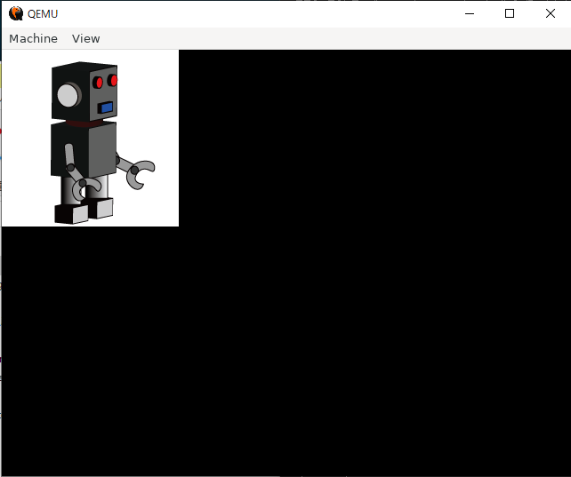

## はじめに

これは[自作OS Advent Calendar 2021](https://adventar.org/calendars/6581)のために書こうと思って間に合わなかった記事を埋葬するものです。

## OS自作との出会い

「OSの自作」という概念と初めて出会ったのは、2002年12月7日、第一回未踏ユースのブースト会議でした。私が博士課程の学生だった時、修士で入ってきた研究室の後輩の紹介で未踏ユースというプロジェクトを知り、私と研究室の後輩二人の三人でチームを組んでプロジェクトを応募、採択していただきました。ブースト会議は、採択されたみんなで集まって、みんながどんなことをやるのかを共有し、仲良くしましょう、みたいな趣旨の会だったと思います。そこに、川合さんがいました。

川合さんは、OSASKという自作OSで採択されていました。それまで「OSを自作する」などと考えたこともなく、非常に驚きました。また、川合さんの発表も新鮮でした。川合さんは、GCCが吐くコードがアホなので、GCCを改造してよりよいコードを吐くようにした、という発表をしていました。「GCCが吐くコードがアホだから、自分でアセンブリを書く」という人は結構いましたが、GCCの方をなんとかしようとする人は初めて見たので、強く印象に残っています。

未踏の後、川合さんとお会いする機会はなかったのですが、OSASKの動向はたびたびチェックしていました。その後、川合さんが[30日でできる! OS自作入門](https://www.amazon.co.jp/dp/4839919844)という本を上梓されたのを知りました。内容がマニアックな上に、705ページという大著。川合さんらしいな、と思いつつ、正直「売れないだろうな」と思っていました。当時、僕は「闘うプログラマー」などの影響で、「オペレーティングシステムとは死ぬほど巨大なソフトウェアであり、多人数によるデスマーチで開発されるもの」という印象がありました。その巨大なソフトウェアを、やはり巨大な本を読んで作ろうなんて思う人が出るんだろうかと。Amazonの書評にも、最初はあまり好意的でないレビューがついていたように思います[^review]。まさかこの本が、「30日OS自作本」としてその後OS自作のバイブル的な扱いを受け、多数の版を重ね、多くのフォロワーを生み出すとは誰が予想したでしょうか。

[^review]: どうでも良いですが、Amazonの書評には、一番最初に批判的なレビューが書かれることが多い気がします。

## 自作ブーム？

時は流れ、OSと同じく巨大なソフトウェアである「コンパイラ」の自作がブームとなりました。おそらく直接的な原因はRui Ueyamaさんの[低レイヤを知りたい人のためのCコンパイラ作成入門](https://www.sigbus.info/compilerbook)ではないかと思います。コンパイラだけでなく、ブラウザやエミュレータ、OSといった、「今目の前にあるものがあまりに巨大過ぎて作ろうとは思えない」ようなソフトウェアの自作を行う若い人をよく見かけるようになりました。

そんな中、2021年3月に内田さんが[ゼロからの OS 自作入門](https://uchan.hateblo.jp/entry/2021/12/04/111745)という本を上梓されました。ちょうど4月から何か「もくもく会」をやろうとしてたところだったので、数名の学生と一緒にOS自作もくもく会をやることにしました。

## OS自作もくもく会とゲーム作りの思い出

「ゼロからのOS自作入門」は、対応するGitHubリポジトリがあり、それをクローンしたら、後はタグを切り替えながらビルドすると、対応する「版」のOSが出来上がるので、実行して「できているな」と確認しながら読みすすめる本です。週に一度、一時間だけという限られた時間で、ゆっくり進めていきました。そんな中で、ピクセルの表示をするところまで進み、そのプログラムを少しいじって以下のような画像を表示することができました。

要するにVRAMにピクセルデータを転送しているだけですが、これをOSの力を借りずにやった、ということで思い出すことがあります。

時を遡ることン十年、僕が中学生の頃、友達とチームを作ってゲームを作っていました。当時のOSはMS-DOS、グラフィックを表示するためのツールもキー入力をとるライブラリも何もないため、全てアセンブリで組むことになります。さて、画像はVRAMと呼ばれる特別なアドレスに、データを書き込むことによって表示されます。DEBUGを使って、指定のアドレスにmovで0xFFを突っ込むと、画面の左上に小さな赤い線が表示されました。RGBのRプレーンに値が突っ込まれ、それが表示されたのです。それができれば、あとはVRAMを適当に書き換えていくことでキャラクターが動いたり、アニメーションさせたりすることができることになります。

僕は、その仕組みを「ふんわり」とは理解していましたが、「小さな赤い線」を描くところから、「キャラクターを描いて動かす」ところまではいけませんでした。結局、キャラクター描画ルーチンや、キー入力をとるコアルーチンはすべて友人が組み、僕はキャラクタを描いたり、その他のプログラムを書いたりしただけでした。同じ本(日高さんの書いたx86の本だったと思います)を読んでいるのに、なぜ彼はバリバリアセンブリが書けて、僕は書けないんだろうと思っていました。アセンブリを理解する才能が僕にはないのかな、と。

結局、中高生時代は「OSの力を借りずにキャラクターを表示する」ことはできずじまいだったのですが、齢40を越えてからようやく「OSの力を借りずにキャラクターを表示する」ことができ、感慨深いものがあります。

## 何かを理解するということ

OS自作もくもく会は4月から10月まで続き、僕は16章まで読み進めました。OSが裏でどういうことをしているか、知らなかったことが多く、多くの知識を得ることができました。しかし、OSとはどういうソフトウェアかは「ふんわり」理解できましたが、「さぁ、OSを書け」と言われたら全く書ける気がしません。中学生の頃、アセンブリの本を読み、仕組みを「ふんわり」と理解したにも関わらず、友達が書いたようなゲームルーチンを組める気がしなかったのと同じです。

同じ本を読んでいるのに、なぜ「自作」できるようになる人と、「自作」できるようにならない人がいるのか。数十年たった今ならわかる気がします。

僕は当時、「アセンブリが難しくて自分には理解できなかった」と思っていました。しかし、今思うと「もっと楽にアセンブリをマスターする方法があるのでは？」と思い、愚直に一つ一つの命令を理解しようとしていませんでした。

最近読んだ[プログラミングというより物事が出来るようになる思考法](https://note.com/simplearchitect/n/n388201603a28)という記事にも似たようなことが書いてありました。

> 私は頭がいい人はああいうのを見て１発で理解できてうらやましいなぁと思っていたけどそうではないのだ。どんなに頭がいい人でも理解には時間がかかるものなのだ。頭のいい人が理解が早いように見えるのは、そうやって時間をかけてきて積み重ねているので、既に理解していることに関して頭のメモリにコンテキストが載っているからだ。

図鑑で車の断面図を見て、車に何が搭載されており、どんな仕組みで動いているか「ふんわり」とわかっても、車を作ることができないのと同じです。車を作るためには、全ての部品がどういう役割を持つか、なぜそんな形をして、その場所にあるかを、愚直に、一つ一つ理解していく必要があります。「自作○○」もすべてそうなのだと思います。

何かをきちんと理解するためには、愚直に、時間をかけて内容を消化し、自分のイメージを掴んでいく、そんな作業が必要なのです。そんな単純なことを理解するのに、何十年もかかってしまいました。

当時中学生だった僕は、今は人に何かを教える立場にいます。こんなポンコツが人に教えるなんて偉そうですが、「ふんわりとした理解と、きちんとした理解には大きなギャップがあり、そのギャップを埋めるには時間をかけなければならない」ということをちゃんと教えていければな、と思っています。
