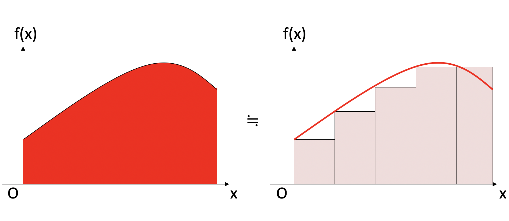

## はじめに

Langevin方程式という方程式があります。例えばこんなのです。

$$
\dot{v} = -\gamma v + \sqrt{2D} \hat{R}
$$

ただし、$\gamma$と$D$は定数で、$\hat{R}$は白色雑音で、

$$
\begin{aligned}
\left<\hat{R}(t)\right> &= 0 \\
\left<\hat{R}(t)\hat{R}(t')\right> &= \delta(t-t')
\end{aligned}
$$

を満たすような確率変数です。この方程式は、水の中の粒子の運動を表しており、$-\gamma v$が水の抵抗による散逸を、$\sqrt{2D} \hat{R}$の項が水分子の衝突による揺動を表現しています。

さて、微分方程式を解くとは、微分している変数について積分し、原始関数を求めることです。しかし、この方程式には$\hat{R}$という確率変数が含まれています。このように確率変数を含む微分方程式を確率微分方程式と呼びます。Langevin方程式は確率微分方程式の一種です。こいつを積分する、ということはどういうことか真面目に考えてみましょう、というのが本稿の目的です。

## 積分とは

### Riemann積分

そもそも積分とはなんだったでしょうか？いま、ある関数$y=f(x)$を$x_s < x < x_e$の区間で積分したいとしましょう。その値を$A$とすると

$$
A = \int_{x_s}^{x_e} f(x) dx
$$

です。この意味は、関数$f(x)$の、区間$x_s < x < x_e$における面積です。とりあえず区間を$N$等分して、$f(x)$の面積を短冊の和として近似してみましょう。

つまり、

$$
A \sim \sum_{k=0}^{N-1} f(x_k) h
$$

ただし、$h = (x_e-x_s)/N$、$x_k = x_s + hk$です。$f(x)$がなめらかなら、$N$無限大の極限でこの和は収束しそうです。その収束値を定積分と定義することにしましょう。つまり、

$$
\int_{x_s}^{x_e} f(x) dx \equiv \lim_{N\rightarrow \infty} \sum_{k=0}^{N-1} f(x_k)h
$$

ちゃんと定義するなら、$\varepsilon$-$\delta$論法を使います。任意の$\varepsilon>0$に対して、ある$\delta > h > 0$が取れて、

$$
\left| \sum_{k=0}^{N-1} f(x_k) h  -A \right| < \varepsilon
$$

を満たすことができる場合、$f(x)$はRiemann可積分であると呼び、$A$を$f(x)$の定積分と定義します。このような積分の定義をRiemann積分と呼びます。我々が通常「積分」というとRiemann積分を指します。ここでは等間隔に分割しましたが、Riemann可積分な場合は任意の分割について同じ定積分値が定義されます。

$$
\int_{x_s}^{x_e} f(x) dx \equiv \lim_{N\rightarrow \infty} \sum_{k=0}^{N-1} f(x_k) (x_{k+1} - x_k)
$$

この場合は、分割区間の最大値$\max\{x_{k+1} - x_k\}$を$h$として、$\delta > h > 0$をとれば同様に$\varepsilon$-$\delta$論法が構築できます。さらに言えば、今は区間$(x_k, x_{k+1})$の左端での関数の値$f(x_k)$を使って近似していますが、右側を使っても、左右の平均値を使っても同じ収束値が得られます(**重要な伏線**)。

$$
\begin{aligned}
\int_{x_s}^{x_e} f(x) dx &\equiv \lim_{N\rightarrow \infty} \sum_{k=0}^{N-1} f(x_k) (x_{k+1} - x_k) \\
&= \lim_{N\rightarrow \infty} \sum_{k=0}^{N-1} f(x_{k+1}) (x_{k+1} - x_k) \\
&= \lim_{N\rightarrow \infty} \sum_{k=0}^{N-1} \frac{f(x_{k+1})+f(x_k)}{2} (x_{k+1} - x_k) \\
\end{aligned}
$$

さて、確率微分方程式を積分するためには、なんか確率変数を積分する必要があります。例えば

$$
\dot{x} = \hat{R}
$$

と、初期条件$x(t=0)$から、任意の時刻における$x(t)$の値を求めるためには、

$$
x(t) = x(0) + \int_0^t \hat{R}(t) dt
$$

を計算する必要があります。これを定義するためには、積分区間を分割し、

$$
\int_0^t \hat{R}(t) dt \equiv \lim_{N\rightarrow \infty}\sum_{k=0}^{N-1} \hat{R}(t_k) h
$$

みたいなものを考えたくなりますね。一般にはこれはウィーナー過程として「定義」してしまいますが、これを離散的なランダムウォークからの極限として導いてみましょう。

## ランダムウォークと連続極限

毎回コインを投げ、表なら右に、裏なら左に一歩進むランダムウォークを考えます。後で連続極限を取るために、一歩の長さを$a$としておきましょう。裏と表が出る確率はいずれも1/2であるとします。$n$ステップ目の場所を$x_n$とすると、

$$
x_{n+1} = x_n + \hat{R}_n
$$

です。ただし$\hat{R}_n$は$1$か$-1$の値をそれぞれ1/2の確率で取る確率変数です。また、異なるステップ間は無相関であるとします。すると、

$$
\begin{aligned}
\left< \hat{R}_n \right> & =0 \\
\left< \hat{R}_m\hat{R}_n \right> &= \delta_{m,n} \\
\end{aligned}
$$

を満たします。さて、時刻$t=0$において、原点にいたとします。つまり$x_0 = 0$です。我々が知りたいのは、ある時刻$t$において、場所$x$にいる確率$P(x,t)$です。

$n$回コインを投げたうち、表が出た枚数を$\hat{X}$としましょう。$k$枚が表であるような確率は二項分布

$$
P(\hat{X}=k) = 
\begin{pmatrix}
n \\k
\end{pmatrix}
\frac{1}{2^n}
$$

で表現できます。したがって、一次の二次のモーメントは

$$
\begin{aligned}
\end{aligned}
$$

さて、$\hat{X}$枚が表ということは、右に$\hat{X}$歩、左に$n-\hat{X}$歩進んでいるので、位置は$x_n = (2\hat{X} -n)a$の場所にいます。平均二乗変位$\left<x_n^2\right>$を計算してみましょう。

$$
\begin{aligned}
\left<x_n^2\right> &= \left< (2\hat{X}-n)^2\right> a^2 \\
&= 4 \left< \hat{X}^2\right>a^2 - 2n \left< \hat{X}\right>a^2 + n^2a^2 \\
&= na^2
\end{aligned}
$$

すなわち、ランダムウォークでは平均自乗変位はステップ数に比例します。ここで、$\left<\hat{X}\right>$は、二項分布の1次のモーメントなので$n/2$、$\left<\hat{X}^2\right>$は二次のモーメントなので$n/4$であることを使いました。

さて、試行回数$n$が大きい時、二項分布は同じ期待値、分散を持つ正規分布で良く近似できます。期待値$\mu$、分散$\sigma^2$を持つ正規分布を$\mathcal{n}(\mu, \sigma^2)$とするなら、確率$p=1/2$、試行回数$n$の二項分布の期待値は$n/2$、分散は$n/4$ですから、$n$回コインを投げて$k$回表がでる確率は、正規分布$\mathcal{n}(n/2, n/4)$で表現できます。$n$回コインを投げて$k$回表が出たとき、位置は$(2k-n)a$の場所にいます。したがって、$n$ステップ後の場所$x_n$の分布は、平均$0$、分散$na^2$の正規分布 $\mathcal{n}(0, na^2)$で書けます。

$$
P(x_n = x) \sim \frac{1}{\sqrt{2 \pi na^2}} \exp\left(-\frac{x^2}{2na^2} \right)
$$

となります。

さて、ランダムウォークにおいて、平均自乗変位$\left<x_n^2\right>$はステップ数$n$に比例するのでした。なので、$n$が大きい時、これを連続的な「時間」だとみなすことができそうです。これは、$na^2=t$を固定したまま$n$無限大の極限をとることに対応します。そして、改めて$n$ステップ後の時刻を$t$とみなすと、

$$
P(x(t) = x) = \frac{1}{\sqrt{2 \pi t}} \exp\left(-\frac{x^2}{2t} \right)
$$

となります。つまり、時刻$t=0$において原点にいた場合、時刻$t$で座標$x$にいる確率は期待値0、分散$t$の正規分布$\mathcal{N}(0,t)$に従う、ということです。

離散的なランダムウォークを表す式はこうでした。

$$
x_{n+1} = x_n + \hat{R}_n
$$

これを連続化した運動方程式を以下であるとします。

$$
\dot{x} = \hat{R}
$$

我々が知りたいのは、これを$0$から$t$まで積分したものです。

$$
x(t) - x(0) = \int_0^t \hat{R} dt
$$

ここで、時刻$t=0$において$x=0$であり、$x(t)$の確率分布が$\mathcal{N}(0,t)$に従うのですから、確率変数$\hat{R}$を積分したものは、$\mathcal{N}(0,t)$に従う確率変数、ということになります。
