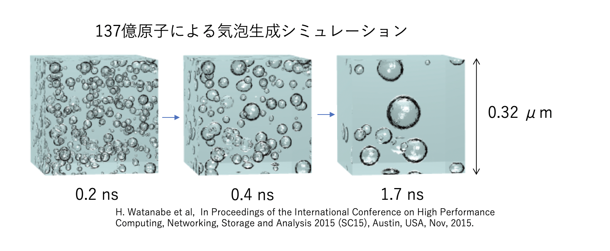
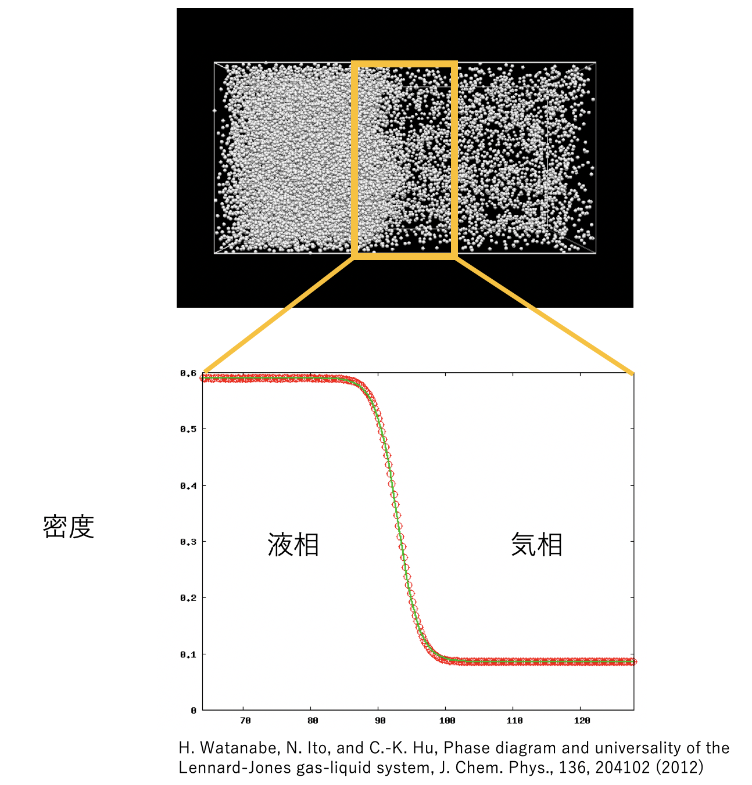

## はじめに

最近、以下の新しい論文を投稿しました。

[Effects of polymers on the cavitating flow around a cylinder: A Large-scale molecular dynamics analysis](https://arxiv.org/abs/2105.07590)

高分子が円柱を過ぎる流れに対して与える影響を分子動力学法で解析したものです。私も共著者には入っていますが、筆頭著者である浅野さんが中心となって計算、解析したものです。

計算規模は、概ね100ノード20万コア5億原子100時間/1ランを複数回実行するくらいです。この論文は物理の論文ですが、本稿ではこの計算の「大きさ」についてつらつら書いてみようと思います。

## 分子動力学法の計算コスト

この論文で用いられている計算手法は分子動力学法(Molecular Dynamics method, MD)と呼ばれるもので、原子の間に働く力を計算し、位置を更新していくことで系を時間発展させていろんな観測をするシミュレーション手法です。分子動力学法は、電子状態をDFTで解く第一原理MDと、原子間の位置で決まる経験ポテンシャルを用いる古典MDにわかれます。さらに、ポテンシャルには力が長距離まで及ぶ場合(クーロン力や重力)と、短距離で減衰する場合があり、この論文の計算では短距離・古典のMDを扱っています。

短距離力を扱う場合、並列化は空間分割が用いられます。プロセスあたり十分に大きい(重い)計算をすれば通信がほぼ無視できるため、計算コストは原子数$N$に比例します。シミュレーションボックスを一辺$L$の立方体とすると、3次元では$N \propto L^3$なので、最終的に計算コストは$L^3$に比例することになります。

しかし、シミュレーションボックスを大きくするほど、平衡(定常)状態になるまでの時間も長くかかることになります。平衡状態とは、系の内部の示強変数が一様になる状態です。平衡化には大雑把にいって系の端から端まで情報が到達するくらいまでの時間がかかります。最も単純には情報は拡散で伝わりますから、時間$t$に対して、到達距離は$\sqrt{t}$に比例します。なので、距離を倍にすると、到達時間は4倍になります。以上から、系のサイズ$L$に対して、平衡化にかかる時間は$L^2$に比例します。

以上を合わせると、平衡/定常状態を計算するためには、シミュレーションボックスの一辺の長さ$L$に対して$L^5$で計算コストがスケールすることになります。これはもっとも単純な場合で、系に遅い緩和があったりするとさらに時間がかかります。一方、非平衡非定常系であれば、平衡化が不要であるため、計算コストは$L^3$ですみます。

私が[2013年に行った計算](https://aip.scitation.org/doi/10.1063/1.4903811)では、京コンピュータの4096ノードを用いて、5億〜7億原子規模シミュレーションをしました。また、[京フルノードを用いたベンチマーク計算](http://sc15.supercomputing.org/sites/all/themes/SC15images/tech_poster/tech_poster_pages/post113.html)では、82944ノードで137億原子の計算をしました。どちらも急減圧シミュレーションで、系を急減圧し、気泡が生成する様子を観測するものです。これは非平衡・非定常であるため、系を平衡化する必要はありません(なお、初期状態として作る平衡状態は比較的容易に作ることができます)。雑にまとめると、2013年当時、世界でもトップレベルのスパコンの、フルノードを使ったベンチマーク的計算で100億原子規模、普段使いのキューで数億原子の「非平衡非定常」が精一杯、という感じです。頑張ればできないことは無かったのでしょうが、当時は京を使っても数億原子規模を平衡化するのはしんどい計算でした。

それに対して、今回の計算では非平衡**定常**状態を扱っているため、まずは系が落ち着くまで計算をすすめる必要があります。具体的には400万ステップのうち、300万ステップで系を定常化させ、実際の観測は残りの100万ステップで行っています。使っている計算資源は物性研究所のスパコン「システムB」です。これは64コアのAMD EPYCを2ソケット載せたノードを1680ノード束ねたもので、総理論性能は6.881PF、TOP500で言うとだいたい50位から100位くらいにランクされる「普段使い」のスパコンです。計算には144ノードのキューが使われました。1680ノードのうち144ノードですから、やはり「普段使い」のキューです。計算時間は1ランが100時間程度、物性研のキューの使用上限は24時間ですから、4本から5本つなぐ計算になります。決して小さい計算ではありませんが、無理に大きいわけでもありません。このように、「普段使いのスパコン」の、「普段使いのキュー」で、数億原子の非平衡定常計算ができるようになった、というのは感慨深いものがあります。

なお、世界ランク50〜100位くらいのスパコンを「普段使い」できるというのは、極めて恵まれた環境です。そういう意味で日本は有数の「スパコン大国」です。スパコンではランキング1位のみが取り沙汰されることが多いですが、基礎研究はこういう「普段使い」のスパコンが支えています。たまに「大きなスパコンを一つだけ用意すれば効率的ではないか」という議論を見かけますが、「選択と集中」の先にあるのは「停滞」、そして「衰退」だけです。

## 短距離古典分子動力学法が表現できるものとサイズ

系の物理量の時間発展を計算機で追う場合、なんらかの離散化をする必要があります。その離散化には大きく分けて「オイラー描像」と「ラグランジュ描像」の二つの方法があります。オイラー描像では、空間に固定された点の上で物理量を定義し、その時間発展を追います。格子法が典型例です。一方、ラグランジュ描像では、系に固定されない点要素が空間を動き回り、物理量はその点上で定義します。SPHなどの粒子法や、本稿で扱う分子動力学法がこれです。粒子法と分子動力学法は混同されやすい手法ですが、扱う支配方程式が異なります。ただし、並列計算手法として見ると、性質は似ているところも多いです。

さて、流体の計算を考えましょう。「オイラー描像」では、系を格子状に区切ってナビエ・ストークス方程式を解くことになります。一方、分子動力学法の支配方程式はニュートンの運動方程式です。格子法では、格子のサイズを好きに決めることができます。グリッドの間隔を1cmだと思うことも、1kmと思うこともできます。例えば自動車の空力計算などではメッシュサイズは1mm程度でしょうし、天気予報のシミュレーションなどでは1km〜数km程度でしょう。

一方、分子動力学法は、粗視化MDなど特別なことをしない限り、構成要素は原子のサイズ、つまり概ね数オングストロームです。例えばMDでよく使われるLennard-Jonesポテンシャルの場合、これをアルゴンだと思うと直径が0.32nm程度です。「京」でがんばって137億原子の計算をした時、1辺が原子直径の1000倍程度、つまり一辺0.32ミクロンの立方体を計算しました。2014年当時、トップランクのスパコンを使っても1ミクロンの計算に届かないくらいのサイズです。時間でいえば、時間ステップがフェムト秒のオーダーなので、がんばってナノ秒程度の計算ができるかな、という感じです。

こんな小さな系を計算して何がわかるのでしょうか？実は、分子動力学法では(みなさんが思うより)小さなサイズの計算で様々なことがわかります。

例えば、平衡状態の物性値、例えば密度や温度の関係などは、かなり小さなサイズで良い値がでます。たとえば10x10x10の千原子もあれば、温度と密度の関係などはわりとよく計算できたりします。粘性率や体積弾性係数など、外場をかけた場合の応答も、線形応答の範囲内であればわりと小さな系でいけます。だいたい20x20x20の、オーダーとして1万原子もあればそれなりの計算ができます。なお、これらは現実の物質の物性値が予測できる、という意味ではなく、シミュレーションとして粘性率や体積弾性係数が意味のある量として定義可能なサイズ、ということ意味です。

さて、千から1万原子あれば平衡状態、線形応答領域はわりといい感じに計算ができますが、そこから外れた領域、特に一様でない系を計算しようとすると急に要求サイズが大きくなります。

まずは相転移を含む場合です。原子間ポテンシャルを適切に定義すれば、系は勝手に相転移します。例えば密度や温度をねらった領域にすれば、気相と液相にわかれた気液共存状態を作ることができます。ここで注意すべきなのは、原子スケールでみると、相の境界は明確でない、ということです。例えば気液共存状態において、相境界付近では密度が液相から気相へとなめらかに変化します。

気液共存状態を作りたいのであれば、この界面長さに対して十分大きなサイズを計算する必要があります。界面の長さは温度に依存しますが、だいたいオーダーとして10原子程度です。なので、最低でもその10倍の大きさの計算をする必要があります。先程、一様な状態であれば一辺が10〜20原子程度で十分という話をしていましたが、気液共存状態という非一様な系を計算するためには、100原子程度のサイズが要求されることになります。気泡を見たければ1万原子程度、多重気泡生成を見たければ100万原子程度、その緩和過程(オストワルド成長)を調べたければ1億原子程度と、見たい物理が複雑化するにつれて要求される原子数が増えていきます。

非一様な系で重要な例としては、不純物が挙げられます。たとえば、液体に微量の高分子を添加すると、劇的に抵抗が下がることが知られています(トムズ効果)。この「微量」というのは本当に微量で、数ppm〜数十ppmオーダーです。このような非常に薄い溶液を計算するためには、溶質に比べて極めて大量の溶媒分子を用意する必要があります。ppmとはparts-per-million、つまり「百万分のいくつ」という値ですから、1ppmの溶液を計算するためには、一つの溶質に対して百万倍の溶媒分子を用意する必要があります。例えば100個の原子がつながった高分子を計算する場合、シミュレーションボックスに高分子鎖が1本だけあっても何もわかりませんから、せめて100本は欲しいところです。すると高分子だけで1万原子。それに対して「十分に薄い」高分子溶液を作るためには、溶媒原子は一千万原子は欲しいところです。さらに、物を通り過ぎる流れなどに高分子が与える影響を知りたければ、もっと高分子鎖が欲しいところです。

冒頭の論文では、500個の原子をつないだ高分子を1万7千本用意し、これらが重ならないギリギリの密度(overlap concentration)とするために、溶媒分子を数億原子ほど用意しています。全体に占める高分子の数密度は1〜2％程度で、ppmに比べたら十分濃いですが、それでも溶液としては薄い状態を実現しています。溶媒同士の相互作用をLennard-Jonesポテンシャルとすることで気液相転移がおきるようにします。すると、流れを早くすると円柱の後方に気泡が発生します(キャビテーション)。さらにそこに高分子を添加することで、高分子がキャビテーションにどのような影響を与えるか、ということを調べることができます。

## 分子動力学法とレイノルズ数

見たい現象が複雑になるほど、非一様になるほど、要求される原子数が増えることを見ました。次に、分子動力学法のサイズと流れとの関係を見てみます。分子動力学法で流れを研究する場合、どんな流れが研究できるでしょうか？流れを特徴づける量として、レイノルズ数という無次元量があります。レイノルズ数が小さければ小さいほどなめらかでおとなしい流れ、大きければ大きいほど激しく複雑な流れになります。レイノルズ数の定義はいくつかありますが、例えば

$$
Re = \frac{VL}{\nu}
$$

を採用しましょう。$L$は系の特徴的な長さ、$V$は特徴的な速度、$\nu$は動粘性係数です。前二つが系のセットアップに依存し、最後の一つが物質に依存する値となります。

例えば今回の研究で扱った円柱周りの流れでは大雑把に

* Re が1より十分小さい時：円柱を回り込むだけの流れ(層流)
* Re が10程度：円柱の後方に双子渦が形成される
* Re が100程度：双子渦が交互に剥がれて後ろに流れていく(カルマン渦列)
* Re が1000程度：流れが乱れ始める
* Re が10000以上：乱流

といった感じになります。

さて、分子動力学法では、どのくらいのレイノルズ数に対応する流れが扱えるのでしょうか？

先程のレイノルズ数の定義を見ると、レイノルズ数を上げるには「流速を増やす」「系のサイズを増やす」「動粘性係数をへらす」必要があります。このうち、動粘性係数は物質固有の値で、Lennard-Jones単位系でいえば、概ね$O(1)$の量となります。温度依存性などはありますが桁で変えることは困難です。また、流れの速度が音速を超えるとおかしなことになります。音速も物質、密度、温度などに依存する量ですが、Lennard-Jones系ではやはり$O(1)$の量です。

以上から、

$$
Re \sim L
$$

となります。つまり、分子動力学法でレイノルズ数を稼ぐには、系のサイズを大きくするしかない、ということです。したがって、レイノルズ数10倍の流れを計算するためには、システムサイズを10倍にする必要があり、計算コストは最低でも$L^5$に比例するので、計算コストは10万倍になります。これは気合と根性で乗り切るにはしんどいコストです。

高レイノルズ数流れにはいろいろ面白い物理がたくさんあるのですが、分子動力学法ではまだまだ手が届かないようです。

## まとめ

私が学生だったころは、頑張って100万原子の計算をして論文を書く感じでした。それが計算機がどんどん発展し、扱える系も大きくなってきました。7年前に「世界トップランクのスパコン」の「フルノード」を使ってなんとかなるかな？という計算が、現在は「普段使い」のスパコンの「普段使い」のキューで実現できるようになってきています。ニュースで話題になるのはトップランクのスパコンを使った派手な計算であることが多いですが、科学は「普段の研究」の積み重ねで発展していきます。そういう意味で、「普段の研究」で数億原子規模が日常的に可能となってきたことは喜ばしいことです。

冒頭の論文では[LAMMPS](https://lammps.sandia.gov/)という、米国エネルギー省(DOE)が管轄するサンディア国立研究所で開発されたアプリケーションを使って計算をしています。1ノード128コア、144ノードのflat-MPIで18432プロセスの並列計算をしてもわりとスルスル動くようです。ただし、LAMMPSを使えば誰でも大規模計算ができる、というわけではありません。大きな系で非平衡定常状態を作る、というのはかなり非自明な作業であり、経験が必要です。です。また、一発ベンチマーク的に現象を再現するのが目的ではなく、そこから物理的な知見を得ることが目的であるため、必要な相図の確認、粘性率の計算など、様々な計算をする必要があります。また、当然ですが大きな計算をすれば大きなデータが出力されますから、そこからどのように有用な情報を抽出するかも非自明です。

一方で、「LAMMPSがあるから並列分子動力学法コードを開発する必要ない」ということもありません。なにかの研究分野が、少数のアプリケーションに依存してしまうと、「プログラムを組む人」と「論文を書く人」の分離が起きてしまい、これは非常に不健康です。すでに様々なプログラミング言語が存在するにも関わらず、日々新しいプログラミング言語が提案、開発されているように、たとえデファクトスタンダードのアプリケーションがあるとしても、新しいアプリケーションを提案、開発していかなければなりません。繰り返しになりますが、「選択と集中」の先にあるのは「停滞」と「衰退」の未来だけです。幅広い挑戦だけが新しい未来を作る確実な方法です。

今後も、若い人がHPC分野にどんどん挑戦し、新しいアプリケーションを作ったり、面白い計算をしてくれることを期待します。
