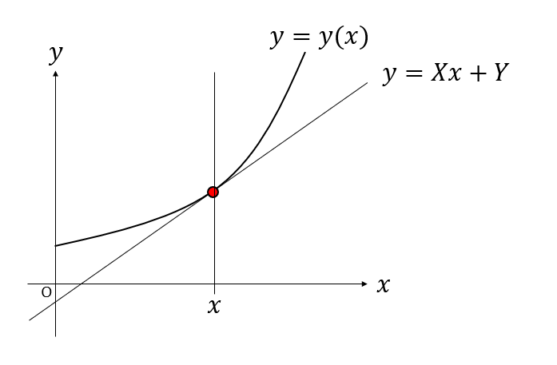
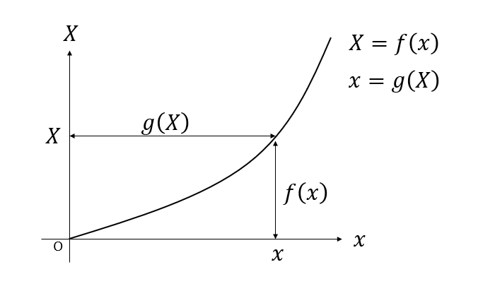

## はじめに

ルジャンドル変換は、自由変数を取り直す変換のことで、双対変換の一種です。双対変換というのは、ざっくり言えば「変換したあと、もう一度変換したらもとにもどる奴」のことです。

例えば正六面体の各面の重心を結ぶと、正八面体になります。この時「正六面体→正八面体」の変換は「面」と「点」の入れ替えに対応しています。同様に、正八面体の各面の重心を結ぶと、正六面体が出てきます。このように、双対変換は「入れ替え」を二度したらもとに戻ります。

また、「AならばB」という命題に対して、「Bでないなら、Aではない」のような命題は対偶と呼ばれますが、両者の真偽は一致します。これも双対です。フーリエ変換やラプラス変換のように、逆変換してもとに戻るやつはだいたい双対変換といって良いでしょう。

このルジャンドル変換の説明として、接線を用いる表式と、面積を用いる表式があります。どちらも同じことを表現していますが、わりと両者の繋がりは不明瞭です。本稿では、両方の気持ちを説明してみようと思います。以下、数学的な厳密さはさておくので、supだのinfだのは出てきません。

## 接線表式

$(x,y)$平面における曲線を考えます。$x$を自由変数として、曲線を$y=y(x)$と表現しましょう。
二次元平面における曲線とは、点$(x,y)$の集合です。

さて、曲線上の点$(x,y)$における接線を考えます。この接線を表す式を

$$
y = Xx + Y
$$

と書きましょう。これは傾き$X$、切片$Y$の直線を表しています。

接線の定義からすぐに

$$
\begin{aligned}
X &= \frac{dy}{dx} \\
Y &= y - x \frac{dy}{dx}
\end{aligned}
$$

であることがわかります。これが$(x,y)$から$(X,Y)$へのルジャンドル変換で、$(x,y)$で表現される点の集合を、$(X,Y)$で表現される直線の集合に入れ替えた、つまり「点」と「線」を入れ替えたことに対応します。

次に、$(X,Y)$の集合を曲線$Y=Y(X)$だと思ってルジャンドル変換してみましょう。

$$
\begin{aligned}
\frac{dY}{dX} &= \frac{dY}{dx}\frac{dx}{dX} = -x\\
Y-X \frac{dY}{dX} &= y - x \frac{dy}{dx} + x \frac{dy}{dx} = y
\end{aligned}
$$

ここから、$(X,Y)$から$(x,y)$に戻すルジャンドル逆変換は、

$$
\begin{aligned}
x &= - \frac{dY}{dX}\\
y &= Y-X \frac{dY}{dX}
\end{aligned}
$$

となります。

順変換と逆変換を並べてみましょう。

$$
\left(
\begin{array}{ccc}
X &=& \displaystyle\frac{dy}{dx}\\
Y &=& y-x \displaystyle \frac{dy}{dx}
\end{array}
\right.
\qquad
\left(
\begin{array}{ccc}
x &=& - \displaystyle\frac{dY}{dX}\\
y &=& Y-X \displaystyle \frac{dY}{dX}
\end{array}
\right.
$$

形はほとんど同じですが、逆変換の$x$の表式に負符号がついています。これを嫌って、接線の式を$y = Xx - Y$と、切片に負符号をつける流儀もあります。すると、負符号がキャンセルして、

$$
\left(
\begin{array}{ccc}
X &=& \displaystyle\frac{dy}{dx}\\
Y &=& x \displaystyle \frac{dy}{dx} -y
\end{array}
\right.
\qquad
\left(
\begin{array}{ccc}
x &=& - \displaystyle\frac{dY}{dX}\\
y &=& X \displaystyle \frac{dY}{dX} -Y
\end{array}
\right.
$$

と、順変換と逆変換が同じ表式になります。

ここで、最終的にもとに戻るならどのような定義を用いても構わないことに注意しましょう。同様な事例に「フーリエ変換で$2\pi$をどちらに押し付けるか問題」があります。工学では順変換には$2\pi$はつけず、逆変換にすべて押し付けますが、数学では対称性を重視してどちらにも$\sqrt{2\pi}$をつけたりします。最終的につじつまが合えばどちらを採用してもかまいません。

## 積分表式

$(x,X)$空間を考えます。この空間における曲線を考えます。$x$を自由変数に取るなら$X=f(x)$、$X$を自由変数にとるなら$x=g(X)$と表現できます。$f$と$g$はお互いに逆関数です。

ここで、$f(x)$を積分したものを$y$を、$g(X)$を積分したものを$Y$と定義します。

$$
\begin{aligned}
y &= \int_0^x f(x) dx \\
Y &= \int_0^X g(X) dX
\end{aligned}
$$

もともと$X=f(x)$、$y=g(X)$でしたから、定義から

$$
X = \frac{dy}{dx} , x = \frac{dY}{dX}
$$

となります。

さて、上の図において長方形が曲線で分割されていると考えると、長方形の面積が$xX$、曲線の下部分の面積が$y$、曲線の左部分の面積が$Y$なので、

$$
y+Y = xX
$$

となります。ここからただちに$(x,y)$と$(X,Y)$の間の変換式が求まります。

$$
\left(
\begin{array}{ccc}
X &=& \displaystyle\frac{dy}{dx}\\
Y &=& y- x \displaystyle \frac{dy}{dx}
\end{array}
\right.
\qquad
\left(
\begin{array}{ccc}
x &=& \displaystyle\frac{dY}{dX}\\
y &=& Y- X \displaystyle \frac{dY}{dX}
\end{array}
\right.
$$

こちらは、自然に順変換と逆変換が同じ形となります。

## ルジャンドル変換の例

大学の物理においてルジャンドル変換は、力学のラグランジアンからハミルトニアンを導くところや、熱力学の自由変数の取り替えなどに現れます。

物理で現れるルジャンドル変換の対象は一般の多変数ですが、注目する変数以外を固定し、一変数関数だと思って変換すれば、常微分が偏微分方になるだけであとは同じです。

さて、$\dot{q}$,$q$の関数であるラグランジアン$L(\dot{q},q)$を考えます。$q$を固定し、この第一引数に関してルジャンドル変換しましょう。これを$(\dot{q}, L)$から、$(p, H)$への変換だと思えば、

$$
\begin{aligned}
p &= \frac{\partial L}{\partial \dot{q}} \\
H &= pq- L
\end{aligned}
$$

となります。これは、順変換と逆変換が同じ形になるタイプのルジャンドル変換です。

次に、内部エネルギー$U$が、エントロピー$S$と体積$V$の関数として$U=U(S,V)$与えられているとしましょう。体積$V$を固定し、$S$に関してルジャンドル変換し、それを$(S,U)$から$(T F)$への変換だと思えば、

$$
\begin{aligned}
T &= \frac{\partial U}{\partial S} \\
F &= U - TS
\end{aligned}
$$

となります。これは、逆変換に負符号が出るタイプのルジャンドル変換です。$U=TS + F$と書けば、$(S,U)$空間において、ある点での接線を表す式になっており、$T$がその傾き、$F$が切片になっていることがわかります。

熱力学では、変換が対称であることより、熱力学関数の凸の向きが変換後も同じであった方が便利なので、こちらの定義を採用しています。

## まとめ

ルジャンドル変換の二つの表式を比べてみました。ルジャンドル変換によって$(x,y)$から$(X,Y)$に移る時、

$$
y = Xx + Y
$$

として「接線」を考えるタイプと、

$$
y + Y = Xx
$$

として面積を考えるタイプがあります。

面積を考えるタイプは、$(x,y)$と$(X,Y)$が完全に対等であることがわかりやすく、自然に順変換と逆変換が等しくなります。また、途中に微分不連続点があっても定義可能です。

一方、説明に使う図が$(x,X)$空間であり、我々の興味ある物理量であるラグランジアン$L$や内部エネルギー$U$が図に直接現れない(積分として現れる)のがちょっとわかりづらいかな、という気がします。

接線を考えるタイプは、ルジャンドル変換が「点」と「直線」の双対変換である、ということがわかりやすい気がします。また、興味ある物理量が直接図に出てきます。

一方で、ナイーブな定義では、逆変換に負符号が現れてしまい、$(x,y)$と$(X,Y)$が対等であることが見えづらい気もします。

個人的には「双対変換」であることがわかりやすい接線タイプの説明が好きですが、表式がきれいな面積タイプの説明を好む人がいるのも理解できます。

本稿が、両者をつなぐ理解の助けになれば幸いです。
