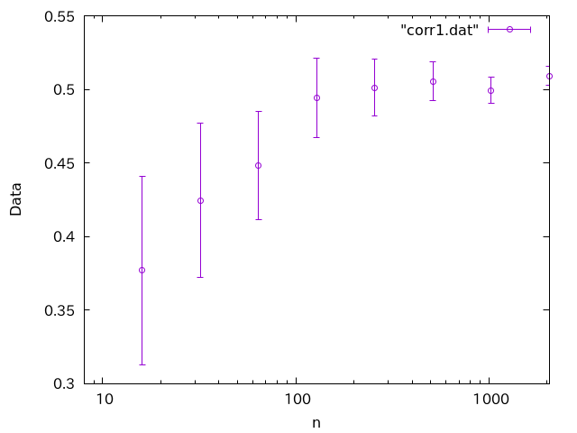
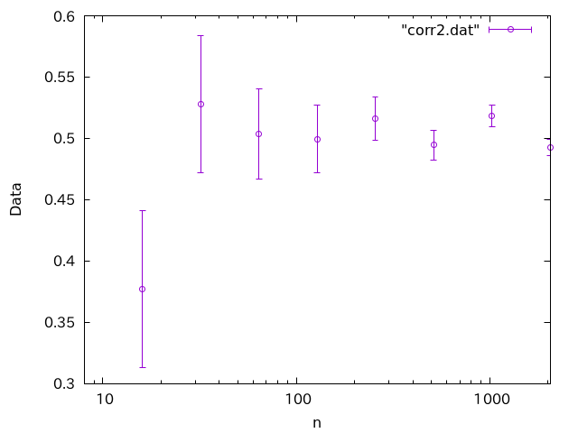

## はじめに

実験や数値計算などでエラーバーがついているグラフをよく使いますが、見ていると「ん？」となるグラフをよく見かけます。いくつか例を挙げて見ましょう。

### ケース1

例えばこんなグラフがあったとします。

何かが時間に対して指数関数的に減衰していることを表しているようです。僕は発表でこういうグラフを見かけたら「ん？」と思います。

一方、こちらのグラフはまともです。

少なくともエラーバーの付き方はまともです。

### ケース2

もし、観測値のそれぞれに独立なノイズが乗っているのであれば、エラーバーは、観測回数を増やせば減っていくはずです。観測回数$n$に対して、物理量の推定値とエラーバーがどうなるかを表したグラフでこんなものがあったとします。

試行回数$n$を増やすにつれて、平均値は$0.5$に収束し、さらにエラーバーも小さくなっています。一見それっぽく見えますが、僕はこのグラフを見たら「ん？」と思います。

一方、こちらも同様なグラフです。

試行回数$n$を増やすにつれて、平均値は$0.5$に収束し、さらにエラーバーも小さくなっているのは先程と同じですが、こちらはまっとうなグラフに見えます。

